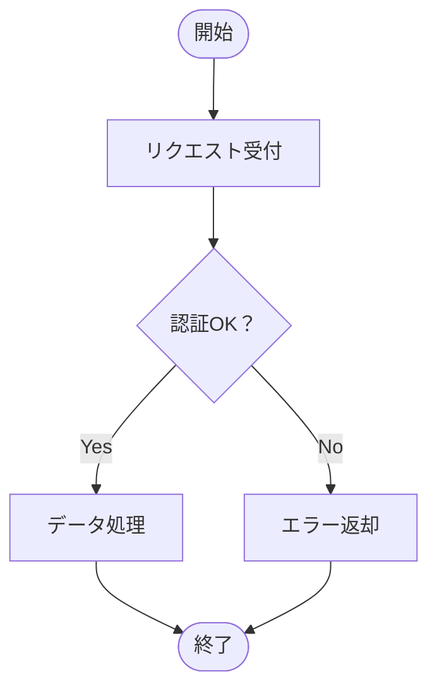

# Diagram Pipeline — How to Use / 利用ガイド

> Mermaid記法やJSONからプロフェッショナルなPowerPointダイアグラムを自動生成するツールです。
>
> Generate professional PowerPoint diagrams from Mermaid notation or JSON input.

---

## Table of Contents / 目次

1. [Quick Start / クイックスタート](#1-quick-start--クイックスタート)
2. [Workflow Overview / ワークフロー概要](#2-workflow-overview--ワークフロー概要)
3. [CLI Usage / コマンドラインツール](#3-cli-usage--コマンドラインツール)
4. [DiagramSpec JSON Reference / JSON仕様リファレンス](#4-diagramspec-json-reference--json仕様リファレンス)
5. [Diagram Types & Examples / 図の種類と実例](#5-diagram-types--examples--図の種類と実例)
6. [Group & Nesting / グループとネスト](#6-group--nesting--グループとネスト)
7. [Swimlanes / スイムレーン](#7-swimlanes--スイムレーン)
8. [Bus Lines / バスライン](#8-bus-lines--バスライン)
9. [Using with Mermaid / Mermaid連携](#9-using-with-mermaid--mermaid連携)
10. [Icon Support / アイコンサポート](#10-icon-support--アイコンサポート)
11. [Theming / テーマ](#11-theming--テーマ)
12. [JSON Diagnostics / JSON診断](#12-json-diagnostics--json診断)
13. [Troubleshooting / トラブルシューティング](#13-troubleshooting--トラブルシューティング)
14. [API Quick Reference / APIクイックリファレンス](#14-api-quick-reference--apiクイックリファレンス)

---

## 1. Quick Start / クイックスタート

### CLI (recommended) / CLI（推奨）

```bash
# JSON → PPTX
python src/diagram_cli.py input.json -o output.pptx

# With custom theme / カスタムテーマ指定
python src/diagram_cli.py input.json -o output.pptx --theme themes/my_theme.yaml

# Validate JSON only / JSONバリデーションのみ
python src/diagram_cli.py input.json --validate-only
```

### Python API / PythonのAPI

```python
from diagram_renderer import render_from_json
import json

spec = json.dumps({
    "type": "flowchart",
    "direction": "TB",
    "title": "My First Diagram",
    "nodes": [
        {"id": "A", "label": "Start", "shape": "rounded_rect"},
        {"id": "B", "label": "Process", "shape": "rect"},
        {"id": "C", "label": "End", "shape": "rounded_rect"}
    ],
    "edges": [
        {"from": "A", "to": "B"},
        {"from": "B", "to": "C"}
    ],
    "groups": []
})

render_from_json(spec, "output.pptx")
```

**Requirements / 必要環境:**

```
pip install python-pptx lxml pyyaml
```

Optional (for icon SVG→PNG conversion / アイコン変換用):
```
pip install wand    # requires ImageMagick
```

Optional (for Mermaid→API conversion / Mermaid API変換用):
```
pip install anthropic   # or: pip install openai
```

---

## 2. Workflow Overview / ワークフロー概要

```
┌──────────────┐      ┌──────────────┐      ┌──────────────┐
│  Input        │      │  DiagramSpec  │      │   Output      │
│  入力         │  →   │  JSON         │  →   │   出力        │
│              │      │              │      │              │
│ ・JSON直接入力│      │ 中間表現      │      │  .pptx file   │
│ ・Mermaid記法 │      │ Intermediate  │      │  PowerPoint   │
│              │      │ representation│      │              │
└──────────────┘      └──────────────┘      └──────────────┘
```

### Three Usage Modes / 3つの利用モード

| Mode / モード | Description / 説明 | How / 方法 |
|---|---|---|
| **Mode 1: JSON Direct** | Write DiagramSpec JSON by hand or programmatically / JSONを直接記述 | `python diagram_cli.py input.json -o out.pptx` |
| **Mode 2: Mermaid → API → PPTX** | Automated LLM API call / LLM APIで自動変換 | `python diagram_cli.py input.mmd -o out.pptx --api-convert` |
| **Mode 3: Show Prompt** | Output system prompt for manual chat use / プロンプトをコピペ用に出力 | `python diagram_cli.py --show-prompt` |

---

## 3. CLI Usage / コマンドラインツール

`diagram_cli.py` はDiagram Pipelineの統合CLIエントリポイントです。JSON/Mermaidファイルの読み込み、バリデーション、PPTX生成、プロンプト表示をサポートします。

### Mode 1: JSON → PPTX

JSON DiagramSpecファイルからPPTXを直接生成します。

```bash
# Basic usage / 基本使用
python src/diagram_cli.py input.json -o output.pptx

# With template PPTX (header bar inheritance) / テンプレートPPTX指定
python src/diagram_cli.py input.json -o output.pptx -t template.pptx

# With custom theme / カスタムテーマ指定
python src/diagram_cli.py input.json -o output.pptx --theme themes/corporate.yaml

# Validate only (no PPTX generation) / バリデーションのみ
python src/diagram_cli.py input.json --validate-only
```

`--validate-only` を指定すると、2段階の検証が実行されます:

1. **構造診断（Structural Diagnostics）**: フィールド存在チェック、未知フィールド検出、タイポ候補の提案
2. **意味検証（Semantic Validation）**: エッジの参照先ノードID、グループ参照、循環検出

```
$ python src/diagram_cli.py input.json --validate-only
⚠ Warnings:
  [edges[2].from] Unknown node reference: "X1"  → suggestion: did you mean "x1"?
✓ Valid DiagramSpec: Network Architecture
  nodes: 12, edges: 18, groups: 4, direction: LR
  (1 warning(s) — see above)
```

### Mode 2: Mermaid → API → PPTX

Mermaidファイル（`.mmd`）をLLM APIで自動的にDiagramSpec JSONに変換し、PPTXを生成します。

```bash
# Anthropic Claude API (default) / Claude API（デフォルト）
export ANTHROPIC_API_KEY="sk-ant-..."
python src/diagram_cli.py flowchart.mmd -o output.pptx --api-convert

# OpenAI GPT-4o API
export OPENAI_API_KEY="sk-..."
python src/diagram_cli.py flowchart.mmd -o output.pptx --api-convert --api-provider openai
```

API変換は以下のステップで実行されます:

1. Mermaidテキスト読み込み
2. システムプロンプト（`src/prompts/mermaid_system_prompt.txt`）＋Few-shot例の組み立て
3. LLM API呼び出し（Claude or GPT-4o）
4. レスポンスJSONの構造診断＋意味検証
5. バリデーション通過後、PPTX生成

### Mode 3: Show Prompt / プロンプト表示

チャットUIにコピー＆ペーストするためのシステムプロンプトを出力します。

```bash
# System prompt only / システムプロンプトのみ
python src/diagram_cli.py --show-prompt

# With Mermaid file as user message / Mermaidファイル付き
python src/diagram_cli.py --show-prompt --with-mermaid flowchart.mmd
```

### CLI Options Summary / CLIオプション一覧

| Option | Description / 説明 |
|---|---|
| `input` | 入力ファイルパス（`.json` or `.mmd`） |
| `-o, --output` | 出力PPTXファイルパス（default: `diagram_output.pptx`） |
| `-t, --template` | テンプレートPPTXファイル（ヘッダーバー継承等） |
| `--theme` | テーマYAMLファイルパスまたはビルトイン名（default: `midnight_executive`） |
| `--api-convert` | Mermaid入力をLLM APIで変換 |
| `--api-provider` | LLM APIプロバイダ: `anthropic`（default）or `openai` |
| `--show-prompt` | システムプロンプトを表示して終了 |
| `--with-mermaid FILE` | `--show-prompt` 使用時にMermaidファイルを含める |
| `--validate-only` | JSONスキーマの検証のみ（PPTX生成なし） |

---

## 4. DiagramSpec JSON Reference / JSON仕様リファレンス

### Top-Level Fields / トップレベルフィールド

| Field | Type | Required | Description |
|---|---|---|---|
| `type` | `string` | ✅ | `"flowchart"` \| `"network"` \| `"orgchart"` |
| `direction` | `string` | — | `"TB"` (default) \| `"LR"` \| `"BT"` \| `"RL"` |
| `title` | `string` | — | Slide title / スライドタイトル |
| `classDefs` | `object` | — | Reusable style definitions / 再利用スタイル定義 |
| `nodes` | `array` | ✅ | Node definitions / ノード定義 |
| `edges` | `array` | ✅ | Edge/connector definitions / エッジ定義 |
| `groups` | `array` | — | Group zone definitions / グループ定義 |
| `lanes` | `array` | — | Swimlane definitions / スイムレーン定義（§7参照） |
| `layout` | `object` | — | Layout parameters / レイアウトパラメータ |

### Node Fields / ノードフィールド

| Field | Type | Required | Description |
|---|---|---|---|
| `id` | `string` | ✅ | Unique identifier / 一意識別子 |
| `label` | `string` | ✅ | Display text / 表示テキスト |
| `sublabel` | `string` | — | Secondary text (orgchart role, etc.) / 副テキスト |
| `shape` | `string` | — | `"rect"` (default), `"rounded_rect"`, `"diamond"`, `"circle"`, `"oval"`, `"hexagon"` |
| `class` | `string` | — | References a key in `classDefs` / classDefsのキー参照 |
| `style` | `object` | — | Per-node style override / ノード個別スタイル |
| `group` | `string` | — | Group membership / 所属グループID |
| `lane` | `string` | — | Swimlane membership / スイムレーン所属ID（§7参照） |
| `icon` | `string` | — | Built-in icon name (see §10) / アイコン名 |

### Edge Fields / エッジフィールド

| Field | Type | Required | Description |
|---|---|---|---|
| `from` | `string` | ✅ | Source node ID / 接続元ノードID |
| `to` | `string` | ✅ | Target node ID / 接続先ノードID |
| `label` | `string` | — | Edge label / エッジラベル |
| `bus_group` | `string` | — | Bus grouping key / バスグループキー（§8参照） |
| `style.color` | `string` | — | Line color hex / 線の色 (default: `"#94A3B8"`) |
| `style.width` | `number` | — | Line width pt / 線の太さ (default: `2`) |
| `style.arrow` | `boolean` | — | Show arrowhead / 矢印 (default: `true`) |
| `style.dash` | `boolean` | — | Dashed line / 破線 (default: `false`) |

### Group Fields / グループフィールド

| Field | Type | Required | Description |
|---|---|---|---|
| `id` | `string` | ✅ | Unique group ID / グループID |
| `label` | `string` | ✅ | Display name / 表示名 |
| `parent` | `string` | — | Parent group ID for nesting / 親グループID（ネスト用） |
| `style.border` | `string` | — | Border color hex / 枠線色 |
| `style.border_dash` | `boolean` | — | Dashed border / 破線枠 |
| `style.fill` | `string` | — | Fill color hex (null = transparent) / 背景色 |

### Lane Fields / スイムレーンフィールド

| Field | Type | Required | Description |
|---|---|---|---|
| `id` | `string` | ✅ | Unique lane ID / レーンID |
| `label` | `string` | ✅ | Display name / 表示名 |
| `style.header_fill` | `string` | — | Header background color / ヘッダー背景色 (default: `"#1E2761"`) |
| `style.header_font_color` | `string` | — | Header text color / ヘッダー文字色 (default: `"#FFFFFF"`) |
| `style.band_fill` | `string` | — | Band fill color (null = alternating) / バンド背景色 |
| `style.border` | `string` | — | Lane separator color / セパレータ色 (default: `"#CBD5E1"`) |
| `style.border_width` | `number` | — | Separator width pt / セパレータ幅 (default: `1.0`) |

### Style (classDefs) Fields / スタイルフィールド

| Field | Type | Default | Description |
|---|---|---|---|
| `fill` | `string` | — | Background color / 背景色 |
| `border` | `string` | — | Border color / 枠線色 |
| `border_width` | `number` | `1.5` | Border width pt / 枠線太さ |
| `border_dash` | `boolean` | `false` | Dashed border / 破線 |
| `font_color` | `string` | `"#FFFFFF"` | Text color / 文字色 |
| `font_size` | `number` | `11` | Font size pt / フォントサイズ |
| `font_bold` | `boolean` | `true` | Bold text / 太字 |

---

## 5. Diagram Types & Examples / 図の種類と実例

### 5.1 Flowchart / フローチャート

Decision flows, process diagrams, approval workflows.
判断フロー、処理フロー、承認ワークフロー等に最適。

```json
{
  "type": "flowchart",
  "direction": "TB",
  "title": "認証フロー / Auth Flow",
  "classDefs": {
    "terminal": {"fill": "#3B82F6", "font_color": "#FFFFFF", "font_bold": true},
    "process":  {"fill": "#1E2761", "border": "#3B82F6", "font_color": "#FFFFFF"},
    "decision": {"fill": "#F59E0B", "font_color": "#1E293B", "font_size": 10}
  },
  "nodes": [
    {"id": "A", "label": "開始",         "shape": "rounded_rect", "class": "terminal"},
    {"id": "B", "label": "リクエスト受付", "shape": "rect",         "class": "process"},
    {"id": "C", "label": "認証OK？",      "shape": "diamond",      "class": "decision"},
    {"id": "D", "label": "データ処理",     "shape": "rect",         "class": "process"},
    {"id": "E", "label": "エラー返却",     "shape": "rect",         "class": "process"},
    {"id": "F", "label": "終了",          "shape": "rounded_rect", "class": "terminal"}
  ],
  "edges": [
    {"from": "A", "to": "B"},
    {"from": "B", "to": "C"},
    {"from": "C", "to": "D", "label": "Yes"},
    {"from": "C", "to": "E", "label": "No"},
    {"from": "D", "to": "F"},
    {"from": "E", "to": "F"}
  ],
  "groups": [],
  "layout": {"node_width": 2.4, "node_height": 0.7, "h_gap": 1.0, "v_gap": 0.6}
}
```

### 5.2 Network Diagram / ネットワーク構成図

Infrastructure topology with zones, icons, and nested groups.
ゾーン分け、アイコン、ネストグループ対応のインフラ構成図。

```json
{
  "type": "network",
  "direction": "LR",
  "title": "Network Zone Architecture",
  "classDefs": {
    "external": {"fill": "#94A3B8", "font_color": "#FFFFFF"},
    "security": {"fill": "#F59E0B", "font_color": "#1E293B", "font_size": 9},
    "app":      {"fill": "#06B6D4", "font_color": "#FFFFFF", "font_size": 9},
    "data":     {"fill": "#8B5CF6", "font_color": "#FFFFFF", "font_size": 9}
  },
  "nodes": [
    {"id": "inet", "label": "Internet", "shape": "oval", "class": "external", "group": "ext"},
    {"id": "fw",   "label": "Firewall", "shape": "rect", "class": "security", "group": "dmz"},
    {"id": "lb",   "label": "Load Balancer", "shape": "rect", "class": "security", "group": "dmz"},
    {"id": "web1", "label": "Web-01", "shape": "rect", "class": "app", "group": "app_zone"},
    {"id": "web2", "label": "Web-02", "shape": "rect", "class": "app", "group": "app_zone"},
    {"id": "db1",  "label": "DB-Master", "shape": "rect", "class": "data", "group": "data_zone"}
  ],
  "edges": [
    {"from": "inet", "to": "fw"},
    {"from": "fw", "to": "lb"},
    {"from": "lb", "to": "web1"},
    {"from": "lb", "to": "web2"},
    {"from": "web1", "to": "db1"},
    {"from": "web2", "to": "db1"}
  ],
  "groups": [
    {"id": "ext",       "label": "External",     "style": {"border": "#94A3B8", "border_dash": true}},
    {"id": "internal",  "label": "Internal",      "style": {"border": "#06B6D4"}},
    {"id": "dmz",       "label": "DMZ",           "parent": "internal", "style": {"border": "#F59E0B", "border_dash": true}},
    {"id": "app_zone",  "label": "App Zone",      "parent": "internal", "style": {"border": "#06B6D4", "border_dash": true}},
    {"id": "data_zone", "label": "Data Zone",     "parent": "internal", "style": {"border": "#8B5CF6", "border_dash": true}}
  ],
  "layout": {"node_width": 1.3, "node_height": 0.6, "h_gap": 0.3, "v_gap": 0.4}
}
```

### 5.3 Organization Chart / 組織図

Hierarchical org structure with role/name sublabels.
役職・氏名の2行表示に対応した階層型組織図。

```json
{
  "type": "orgchart",
  "direction": "TB",
  "title": "組織図",
  "classDefs": {
    "ceo":  {"fill": "#141B41", "border": "#3B82F6", "font_size": 12},
    "vp":   {"fill": "#1E2761", "border": "#3B82F6"},
    "team": {"fill": "#2D3A6E", "border": "#3B82F6", "font_size": 10}
  },
  "nodes": [
    {"id": "CEO", "label": "田中 太郎", "sublabel": "CEO",           "shape": "rounded_rect", "class": "ceo"},
    {"id": "VP1", "label": "鈴木 花子", "sublabel": "VP Engineering", "shape": "rounded_rect", "class": "vp"},
    {"id": "VP2", "label": "佐藤 次郎", "sublabel": "VP Sales",      "shape": "rounded_rect", "class": "vp"},
    {"id": "T1",  "label": "高橋 一郎", "sublabel": "Backend",       "shape": "rounded_rect", "class": "team"},
    {"id": "T2",  "label": "伊藤 真理", "sublabel": "Frontend",      "shape": "rounded_rect", "class": "team"}
  ],
  "edges": [
    {"from": "CEO", "to": "VP1", "style": {"color": "#3B82F6"}},
    {"from": "CEO", "to": "VP2", "style": {"color": "#3B82F6"}},
    {"from": "VP1", "to": "T1",  "style": {"color": "#3B82F6"}},
    {"from": "VP1", "to": "T2",  "style": {"color": "#3B82F6"}}
  ],
  "groups": [],
  "layout": {"node_width": 1.8, "node_height": 0.8, "h_gap": 0.3, "v_gap": 0.8}
}
```

---

## 6. Group & Nesting / グループとネスト

### Flat Groups / フラットグループ

Nodes with the same `group` value are enclosed in a labeled zone rectangle.
同一 `group` 値のノードがラベル付き枠で囲まれます。

```json
"nodes": [
  {"id": "fw", "label": "Firewall", "group": "dmz"},
  {"id": "lb", "label": "LB",       "group": "dmz"}
],
"groups": [
  {"id": "dmz", "label": "DMZ Zone", "style": {"border": "#F59E0B"}}
]
```

### Nested Groups / ネストグループ（最大3段）

Use `parent` to create hierarchy. Max depth: 3 levels.
`parent` フィールドで階層構造を表現。最大3段まで。

```json
"groups": [
  {"id": "dc",     "label": "Datacenter"},
  {"id": "floor1", "label": "Floor 1", "parent": "dc"},
  {"id": "rack1a", "label": "Rack 1A", "parent": "floor1"}
]
```

**Rules / ルール:**

- A node belongs to its **immediate** group only (not ancestors)
  ノードは直接の所属グループのみ参照する（祖先は不要）
- `parent` must reference an existing group ID
  `parent` は既存のグループIDを参照すること
- Circular references are detected and rejected
  循環参照は検出・拒否される
- Deeper nesting → use `border_dash: true` for visual distinction
  深いネストには `border_dash: true` で視覚的区別を推奨

---

## 7. Swimlanes / スイムレーン

スイムレーンは、スライドを交差軸方向の帯（バンド）に分割し、ノードを責任領域やフェーズごとにグループ化します。グループとは異なり、レーンはスライド全体を横断するヘッダー付きの帯として描画されます。

Swimlanes divide the slide into parallel bands along the cross-axis, visually grouping nodes by responsibility or phase. Unlike groups, lanes span the full slide with labeled headers.

### Direction and Lane Orientation / 方向とレーンの向き

| Direction | Lane orientation / レーンの向き | Description / 説明 |
|---|---|---|
| `TB` / `BT` | Vertical columns / 縦のカラム | フローは上下、レーンは左右に並ぶ |
| `LR` / `RL` | Horizontal rows / 横のバンド | フローは左右、レーンは上下に重なる |

### Example: Approval Workflow with Swimlanes / 承認フローのスイムレーン例

```json
{
  "type": "flowchart",
  "direction": "TB",
  "title": "承認フロー（部門別）",
  "lanes": [
    {"id": "applicant", "label": "申請者"},
    {"id": "manager",   "label": "マネージャー"},
    {"id": "system",    "label": "システム"}
  ],
  "nodes": [
    {"id": "A", "label": "申請作成",   "shape": "rounded_rect", "lane": "applicant"},
    {"id": "B", "label": "承認レビュー", "shape": "rect",         "lane": "manager"},
    {"id": "C", "label": "承認？",      "shape": "diamond",      "lane": "manager"},
    {"id": "D", "label": "処理実行",    "shape": "rect",         "lane": "system"},
    {"id": "E", "label": "差戻し",      "shape": "rect",         "lane": "manager"},
    {"id": "F", "label": "完了通知",    "shape": "rounded_rect", "lane": "system"}
  ],
  "edges": [
    {"from": "A", "to": "B"},
    {"from": "B", "to": "C"},
    {"from": "C", "to": "D", "label": "Yes"},
    {"from": "C", "to": "E", "label": "No"},
    {"from": "D", "to": "F"},
    {"from": "E", "to": "A"}
  ],
  "groups": []
}
```

### Notes / 注意事項

- ノードは `lane` と `group` の両方に同時に所属可能です。ただし、レーンが定義されている場合、レイアウトはスイムレーンモード（v3）で実行されます。
- `lanes` 配列での定義順がスライド上のレーンの並び順になります。
- レーンに所属しないノードがある場合、自動的に「その他（Other）」レーンが作成されます。
- レーンヘッダーのスタイルはレーンごとにカスタマイズ可能です。`style` フィールドを省略するとデフォルトスタイル（ダークネイビーヘッダー、白文字）が適用されます。

---

## 8. Bus Lines / バスライン

バスラインは、複数の接続線を1本の共有幹線にまとめて描画する機能です。Fan-in（N→1）およびFan-out（1→N）パターンに対応し、ネットワーク構成図など接続数が多い図の視認性を大幅に向上させます。

Bus lines consolidate multiple edges into a shared trunk line, supporting both fan-in (N→1) and fan-out (1→N) patterns to dramatically improve readability in dense diagrams.

### Explicit bus_group / 明示的バスグループ

エッジの `bus_group` フィールドに同じキーを設定すると、それらのエッジが1つのバスとして描画されます。

```json
"edges": [
  {"from": "web1", "to": "db", "bus_group": "db_access"},
  {"from": "web2", "to": "db", "bus_group": "db_access"},
  {"from": "web3", "to": "db", "bus_group": "db_access"}
]
```

上記の例では、3本の個別線の代わりに、web1/web2/web3から1本の共有幹線がdbに接続されます。

### Auto-detection / 自動検出

`bus_group` を明示的に指定しなくても、以下の条件を**すべて**満たすエッジ群は自動的にバスとして描画されます:

1. Fan-in（N sources → 1 target）またはFan-out（1 source → N targets）パターンである
2. 2本以上のエッジがある
3. グループ内のどのエッジにもラベルがない（ラベルは個別の意味を持つため）
4. すべてのエッジが同一のビジュアルスタイル（color, dash, width）を持つ
5. バックエッジ（逆方向参照）ではない

Auto-detection automatically consolidates fan-in/fan-out patterns when ALL of the above conditions are met, without requiring explicit `bus_group`. If any edge in the group has a label or a different style, the entire group is drawn as individual lines.

### When to use explicit bus_group / 明示的指定を使うべきケース

- ラベル付きエッジをバスにまとめたい場合
- 自動検出では拾えない組み合わせ（例: 異なるスタイルのエッジを意図的にまとめたい）
- バスのグループ分けを厳密に制御したい場合

---

## 9. Using with Mermaid / Mermaid連携

### Step 1: Write Mermaid / Mermaid記法を書く



### Step 2: Convert to JSON / JSONに変換

**Option A — CLI API Convert（推奨） / CLI自動変換:**

```bash
# Anthropic Claude API
export ANTHROPIC_API_KEY="sk-ant-..."
python src/diagram_cli.py flowchart.mmd -o output.pptx --api-convert

# OpenAI GPT-4o
export OPENAI_API_KEY="sk-..."
python src/diagram_cli.py flowchart.mmd -o output.pptx --api-convert --api-provider openai
```

変換結果のJSONは自動的に構造診断＋意味検証されます。エラーがあればメッセージが表示されます。

**Option B — Chat-based / チャットベース:**

Use the system prompt in `src/prompts/mermaid_system_prompt.txt` with your preferred LLM (ChatGPT, Claude, etc.).

`src/prompts/mermaid_system_prompt.txt` のシステムプロンプトをお好みのLLM（ChatGPT, Claude等）に設定して変換します。

```
System: [contents of mermaid_system_prompt.txt]
User: [paste your Mermaid code]
→ LLM outputs DiagramSpec JSON
```

**Option C — Show Prompt for Copy-Paste / プロンプト出力:**

```bash
# System prompt only / システムプロンプトのみ表示
python src/diagram_cli.py --show-prompt

# With Mermaid file included as user message / ユーザーメッセージにMermaid付き
python src/diagram_cli.py --show-prompt --with-mermaid flowchart.mmd
```

出力されるプロンプトにはシステムプロンプト、Few-shot例、（指定時は）Mermaid入力が含まれます。

### Step 3: Render / レンダリング

```bash
# CLI
python src/diagram_cli.py output.json -o output.pptx
```

```python
# Python API
from diagram_renderer import render_from_json

json_str = '{"type": "flowchart", ...}'
render_from_json(json_str, "output.pptx")
```

---

## 10. Icon Support / アイコンサポート

Network diagrams can use built-in SVG icons that render above the node label.
ネットワーク図ではノードラベルの上にSVGアイコンを表示できます。

### Available Icons / 利用可能アイコン

| Icon Name | Use Case / 用途 |
|---|---|
| `router` | Routers, gateways / ルーター、ゲートウェイ |
| `switch` | L2/L3 switches / スイッチ |
| `server` | Web/App servers / Webサーバ、Appサーバ |
| `database` | Databases / データベース |
| `cloud` | Cloud services / クラウドサービス |
| `firewall` | Firewalls, WAF / ファイアウォール |
| `client` | PCs, desktops / クライアント端末 |
| `internet` | Internet / インターネット |
| `load_balancer` | Load balancers / ロードバランサ |
| `wireless_ap` | Wi-Fi access points / 無線AP |
| `storage` | NAS, SAN, S3 / ストレージ |
| `printer` | Printers / プリンター |
| `phone` | IP phones / IP電話 |
| `vpn` | VPN tunnels / VPNトンネル |
| `monitor` | Monitoring dashboards / 監視ダッシュボード |

### Usage / 使い方

```json
{"id": "fw", "label": "Firewall", "icon": "firewall", "group": "dmz"}
```

When using icons, increase `node_height` to accommodate both icon and label:
アイコン使用時は `node_height` を大きくしてアイコンとラベルの両方が収まるようにします。

```json
"layout": {"node_width": 1.4, "node_height": 1.2, ...}
```

> **Note / 注意:** Icon rendering requires `wand` (ImageMagick Python binding).
> アイコン描画には `wand`（ImageMagickのPythonバインディング）が必要です。

### Custom Icons / カスタムアイコンの使用

ビルトイン以外のアイコンも使用できます。`icon` フィールドにファイルパスを直接指定してください。

```json
{"id": "k8s", "label": "Kubernetes", "icon": "/path/to/kubernetes.svg", "group": "platform"}
```

対応フォーマット: `.svg`, `.png`, `.jpg`, `.jpeg`, `.gif`, `.bmp`

SVGファイルは `wand`（ImageMagick）で自動的にPNGに変換され、システムの一時ディレクトリにキャッシュされます（ファイルの更新日時が変わると自動的に再変換）。PNG等のラスター画像はそのまま埋め込まれるため、`wand` は不要です。

### Adding Built-in Icons / ビルトインアイコンの追加手順

プロジェクトに新しいビルトインアイコンを追加する場合は、以下の2ステップで完了します。

**Step 1:** SVGファイルを `src/icons/` ディレクトリに配置します。ファイル名がそのままアイコン名になります。

```
src/icons/{icon_name}.svg
```

SVGの推奨仕様:

- 正方形のviewBox（例: `viewBox="0 0 64 64"`）
- シンプルなパス構成（グラデーション等は変換時に崩れる可能性あり）
- 単色または2色程度（スライド上で小さく表示されるため）

**Step 2:** `src/diagram_schema.py` の `BUILTIN_ICONS` セットにアイコン名を追加します。

```python
# diagram_schema.py
BUILTIN_ICONS = {
    "router", "switch", "server", "database", "cloud",
    "firewall", "client", "internet",
    "load_balancer", "wireless_ap", "storage", "printer",
    "phone", "vpn", "monitor",
    "container",   # ← 新規追加
}
```

追加後、JSONで `"icon": "container"` として参照できるようになります。

### Changing Built-in Icons / ビルトインアイコンの差し替え

既存のビルトインアイコンを変更する場合は、`src/icons/{name}.svg` を新しいファイルで上書きするだけです。変換キャッシュはファイルの更新日時（`mtime`）ベースで管理されているため、次回実行時に自動的にPNGが再生成されます。

### Verifying Icons / アイコンの動作確認

`diagram_icons.py` をスクリプトとして直接実行すると、全ビルトインアイコンの一覧とSVG→PNG変換テストが実行されます。

```bash
python src/diagram_icons.py
```

```
Available icons (15/15):
  client           → /path/to/src/icons/client.svg
  cloud            → /path/to/src/icons/cloud.svg
  ...

SVG→PNG conversion test:
  client           → /tmp/diagram_icon_cache/client_xxxx_128.png (2,345 bytes)
  ...
```

---

## 11. Theming / テーマ

### Overview / 概要

Diagram Pipelineはテーマシステムにより、パレット、フォント、ノードスタイル、描画パラメータを一括管理します。デフォルトテーマは **Midnight Executive** — ダークで洗練されたプロフェッショナルなカラースキームです。

The theme system manages palette, fonts, node defaults, and rendering parameters. The default theme is **Midnight Executive**.

### Using Custom Themes / カスタムテーマの使用

```bash
# CLI: --theme でYAMLファイルを指定
python src/diagram_cli.py input.json -o output.pptx --theme themes/corporate.yaml

# themes/ ディレクトリ内のファイルは名前だけで指定可能
python src/diagram_cli.py input.json -o output.pptx --theme corporate.yaml
python src/diagram_cli.py input.json -o output.pptx --theme corporate
```

```python
# Python API
from diagram_theme import ThemeConfig
from diagram_renderer import render_from_json

theme = ThemeConfig.from_yaml("themes/corporate.yaml")
render_from_json(json_str, "output.pptx", theme=theme)
```

### Theme YAML Structure / テーマYAMLの構造

テーマYAMLはデフォルト（Midnight Executive）からの差分上書きで動作します。変更したいフィールドのみ記述すれば、残りはデフォルト値が適用されます。

```yaml
name: "Corporate Blue"

palette:
  navy: "003366"          # メイン背景（'#' なしの6桁hex）
  accent: "0066CC"        # アクセント
  teal: "00A5B5"          # ティール
  amber: "FF9900"         # 判断/警告
  white: "FFFFFF"         # ダーク背景上の文字
  dark_text: "333333"     # ライト背景上の文字

fonts:
  heading: "Arial"        # タイトル、ノードテキスト
  body: "Arial"           # ラベル、説明
  mono: "Courier New"     # コード（将来用）

diagram_style:
  title_font_size: 22
  edge_color: "#999999"
  slide_bg: "#F0F0F0"

node_defaults:
  flowchart:
    terminal: {"fill": "#0066CC", "font_color": "#FFFFFF", "font_bold": true}
    process:  {"fill": "#003366", "border": "#0066CC", "font_color": "#FFFFFF"}
```

### Palette Fields / パレットフィールド一覧

| Field | Default | Description / 用途 |
|---|---|---|
| `navy` | `1E2761` | 標準ノード背景 |
| `dark_navy` | `141B41` | 最上位ノード（CEO等） |
| `ice_blue` | `CADCFC` | サブテキスト、ハイライト |
| `white` | `FFFFFF` | ダーク背景上の文字 |
| `light_gray` | `F5F7FA` | スライド背景 |
| `panel_gray` | `EDF0F7` | パネル背景 |
| `mid_gray` | `94A3B8` | コネクタ線、外部ノード |
| `dark_text` | `1E293B` | ライト背景上の文字 |
| `accent` | `3B82F6` | 青アクセント、枠線 |
| `accent_dark` | `2563EB` | 濃いアクセント |
| `teal` | `06B6D4` | ティール（ネットワーク） |
| `amber` | `F59E0B` | 判断ノード、警告 |
| `soft_navy` | `2D3A6E` | サブノード背景 |
| `card_bg` | `F0F4FF` | カード背景 |

### Extracting Theme from PPTX / PPTXからテーマ抽出

既存のPPTXテンプレートからテーマYAMLを自動生成できます。

```bash
# 基本使用: テーマ抽出 → YAML出力
python src/pptx_to_theme.py template.pptx -o themes/extracted.yaml

# 標準出力に出力
python src/pptx_to_theme.py template.pptx

# 抽出統計を表示
python src/pptx_to_theme.py template.pptx --stats
```

**抽出される内容:**

- **palette**: スライドレイアウトXML内の実際の塗りつぶし色を輝度ベースで分類し、パレットロールに自動マッピング
- **fonts**: OOXMLフォントスキーム（`<a:fontScheme>`）から見出し/本文フォントを抽出。レイアウト内の実使用フォントもフォールバックとして参照
- **node_defaults**: デフォルト値のまま出力（自動マッピングは難しいため手動調整推奨）

> **Note / 注意:** 自動抽出の精度は約85%です。特に近い輝度の色（light_gray と card_bg 等）は入れ替わる可能性があります。抽出後のYAMLを確認・微調整することを推奨します。

### Color Palette Reference / カラーパレットリファレンス（Midnight Executive）

| Name | Hex | Use / 用途 |
|---|---|---|
| Navy | `#1E2761` | Standard node fill / 標準ノード背景 |
| Dark Navy | `#141B41` | Primary dark background / メイン背景色 |
| Soft Navy | `#2D3A6E` | Secondary node fill / セカンダリ背景 |
| Accent | `#3B82F6` | Accent, borders / アクセント、枠線 |
| Ice Blue | `#CADCFC` | Subtle highlights / 控えめなハイライト |
| Teal | `#06B6D4` | Network elements / ネットワーク要素 |
| Amber | `#F59E0B` | Decisions, warnings / 判断・警告 |
| Mid Gray | `#94A3B8` | Edges, secondary / コネクタ、セカンダリ |

### Custom Styles / カスタムスタイル

You can override default colors per-node or per-edge using inline `style`:
`style` フィールドでノード/エッジごとに色を個別指定できます。

```json
{
  "id": "alert",
  "label": "Warning",
  "style": {"fill": "#EF4444", "font_color": "#FFFFFF", "border": "#DC2626"}
}
```

---

## 12. JSON Diagnostics / JSON診断

### CLI Validation / CLIバリデーション

```bash
python src/diagram_cli.py input.json --validate-only
```

### Two-Phase Validation / 2段階バリデーション

**Phase 1: Structural Diagnostics / 構造診断**

JSONの構造的な問題を検出します。エラー（error）と警告（warning）の2レベルがあります。

検出される問題:

- 必須フィールド（`type`, `nodes`, `edges`）の欠如
- ルートが辞書でない
- 未知のフィールド名（タイポ候補の提案付き）
- ノード/エッジ内の未知フィールド

```
⚠ Warnings:
  [root.directon] Unknown field "directon"  → suggestion: did you mean "direction"?
✗ Errors:
  [root] Missing required field: "nodes"
```

**Phase 2: Semantic Validation / 意味検証**

構造診断にエラーがなければ、DiagramSpecとしてパースし意味的整合性を検証します。

検出される問題:

- エッジの `from`/`to` が存在しないノードIDを参照
- ノードの `group` が存在しないグループIDを参照
- グループの `parent` が存在しないグループIDを参照
- グループの循環参照
- ネスト深度が3を超える
- ノードの `lane` が存在しないレーンIDを参照

### Python API

```python
from diagram_schema import diagnose_json, parse_diagram_json

# Phase 1: Structural diagnostics
issues = diagnose_json(json_text)
errors = [i for i in issues if i.level == "error"]
warnings = [i for i in issues if i.level == "warning"]

for w in warnings:
    print(f"⚠ [{w.path}] {w.message}")
    if w.suggestion:
        print(f"  → {w.suggestion}")

# Phase 2: Semantic validation (only if no structural errors)
if not errors:
    spec = parse_diagram_json(json_text)  # raises on invalid
```

---

## 13. Troubleshooting / トラブルシューティング

### Common Issues / よくある問題

| Problem / 問題 | Cause / 原因 | Solution / 対策 |
|---|---|---|
| Nodes overflow slide | Too many nodes with large `node_width` / ノードが多すぎて `node_width` が大きい | Reduce `node_width` and `h_gap` / `node_width` と `h_gap` を小さくする |
| Group boxes overlap | Using v1 layout with nested groups / ネストグループでv1レイアウト使用 | Ensure groups have `parent` set correctly / `parent` が正しく設定されているか確認 |
| Icon not showing | Missing `wand` or icon name typo / `wand` 未インストールまたはアイコン名のtypo | Install wand, check icon name against §10 list / wandをインストール、§10のリスト参照 |
| Validation error | Invalid node/edge references / 無効なノード・エッジ参照 | Run `--validate-only` to see detailed diagnostics / `--validate-only` で詳細診断 |
| Circular group error | Group A → parent B → parent A / グループの循環参照 | Break the cycle in `parent` chain / `parent` チェーンの循環を解消 |
| Bus lines not merging | Edges have labels or different styles / ラベルやスタイル差異あり | Remove labels or use explicit `bus_group` / ラベル削除、または `bus_group` 明示指定 |
| Lane node in wrong position | Node missing `lane` field / ノードに `lane` 未指定 | Add `lane` field to node / ノードに `lane` フィールドを追加 |
| API convert fails | Missing API key or package / APIキーまたはパッケージ未設定 | Set `ANTHROPIC_API_KEY` or `OPENAI_API_KEY`, install SDK / 環境変数設定、SDK install |
| Theme not found | Wrong path or missing `.yaml` / パスが間違いまたは拡張子なし | Check `themes/` directory, try with/without `.yaml` extension / パス確認 |

### Layout Algorithm Notes / レイアウトアルゴリズムのメモ

レイアウトエンジンは3つのモードで動作します:

- **v1 (Simple)**: グループなし、レーンなしの場合。シンプルな自動センタリング＋均一スケール
- **v2 (Group-aware)**: グループあり、レーンなしの場合。交差軸方向に専用バンドを割り当て、重なり防止
- **v3 (Swimlane)**: `lanes` が定義されている場合。レーンごとにバンドを分割してノードを配置

コネクタルーティングには以下の最適化が適用されます:

- **Barycenter crossing minimization**: レイヤー内のノード順をエッジ交差が最小になるよう並べ替え
- **Port offset assignment**: 同一ノードから複数エッジが出入りする場合、ポート位置を [-0.35, +0.35] の範囲でずらして重なりを防止
- **Two-phase routing (Plan → Nudge → Draw)**: L字/Manhattan経路を一括計画し、水平セグメントの重なりをナッジで解消してから描画
- **Auto-bus detection**: Fan-in/Fan-outパターンを自動検出してバスライン化

### Auto-scaling behavior / 自動スケーリング

The layout engine automatically scales diagrams to fit within the slide area (13.333" × 7.5"). No manual adjustment is needed for most cases.

レイアウトエンジンがスライド領域内に収まるよう自動スケーリングします。ほとんどの場合、手動調整は不要です。

---

## 14. API Quick Reference / APIクイックリファレンス

### CLI / コマンドライン

```bash
# JSON → PPTX
python src/diagram_cli.py input.json -o output.pptx

# JSON → Validate only
python src/diagram_cli.py input.json --validate-only

# JSON → PPTX with theme
python src/diagram_cli.py input.json -o output.pptx --theme themes/corporate.yaml

# JSON → PPTX with template
python src/diagram_cli.py input.json -o output.pptx -t template.pptx

# Mermaid → API → PPTX (Anthropic)
python src/diagram_cli.py input.mmd -o output.pptx --api-convert

# Mermaid → API → PPTX (OpenAI)
python src/diagram_cli.py input.mmd -o output.pptx --api-convert --api-provider openai

# Show prompt
python src/diagram_cli.py --show-prompt
python src/diagram_cli.py --show-prompt --with-mermaid input.mmd

# Extract theme from PPTX
python src/pptx_to_theme.py template.pptx -o themes/extracted.yaml
```

### Python API / PythonのAPI

```python
# ── Rendering ──

# Render JSON string → PPTX file
render_from_json(json_str, output_path, template_path=None, theme=DEFAULT_THEME)

# Render DiagramSpec object → Presentation object
render_diagram(spec, prs=None, template_path=None, theme=DEFAULT_THEME)

# ── Parsing & Validation ──

# Parse JSON string → validated DiagramSpec
parse_diagram_json(json_str) → DiagramSpec

# Structural diagnostics (typo detection, unknown fields)
diagnose_json(json_str) → list[DiagnosticIssue]

# ── Theming ──

# Load custom theme from YAML (merges over defaults)
ThemeConfig.from_yaml("themes/corporate.yaml") → ThemeConfig

# Export theme to YAML (for template/reference)
theme.to_yaml("themes/output.yaml")

# Get classDefs for a diagram type
theme.get_classdefs_for_type("flowchart") → dict

# Extract theme from existing PPTX (CLI tool)
# python src/pptx_to_theme.py template.pptx -o themes/extracted.yaml
```

### Adding Multiple Diagrams / 複数図の追加

```python
from diagram_renderer import render_diagram
from diagram_schema import parse_diagram_json

prs = None  # accumulate slides
for json_str in [diagram1_json, diagram2_json, diagram3_json]:
    spec = parse_diagram_json(json_str)
    prs = render_diagram(spec, prs=prs)

prs.save("multi_diagram.pptx")
```

### Layout Parameters / レイアウトパラメータ

| Parameter | Unit | Description |
|---|---|---|
| `node_width` | inches | Node width / ノード幅 |
| `node_height` | inches | Node height / ノード高さ |
| `h_gap` | inches | Horizontal gap between nodes / ノード間隔 |
| `v_gap` | inches | Vertical gap between layers / レイヤー間隔 |

### Recommended Presets / 推奨プリセット

| Diagram Type | `node_width` | `node_height` | `h_gap` | `v_gap` |
|---|---|---|---|---|
| Flowchart | 2.4 | 0.7 | 1.0 | 0.6 |
| Network (no icons) | 1.6 | 0.6 | 0.3 | 0.5 |
| Network (with icons) | 1.4 | 1.2 | 0.3 | 0.4 |
| Network (nested groups) | 1.3 | 0.6 | 0.3 | 0.4 |
| Orgchart | 1.8 | 0.8 | 0.3 | 0.8 |

### Direction / 方向

| Value | Description |
|---|---|
| `"TB"` | Top → Bottom / 上から下 (default) |
| `"LR"` | Left → Right / 左から右 |
| `"BT"` | Bottom → Top / 下から上 |
| `"RL"` | Right → Left / 右から左 |

---

> **See also / 関連ドキュメント:**
> - [`ARCHITECTURE.md`](./ARCHITECTURE.md) — System architecture / システムアーキテクチャ
> - [`DIAGRAM_PIPELINE_SPEC.md`](./DIAGRAM_PIPELINE_SPEC.md) — Detailed schema & algorithm docs / スキーマ・アルゴリズム詳細
> - [`DETAILED_DESIGN.md`](./DETAILED_DESIGN.md) — Detailed design document / 詳細設計書
> - [`PROJECT_SPEC.md`](./PROJECT_SPEC.md) — Full project specification / プロジェクト全体仕様
