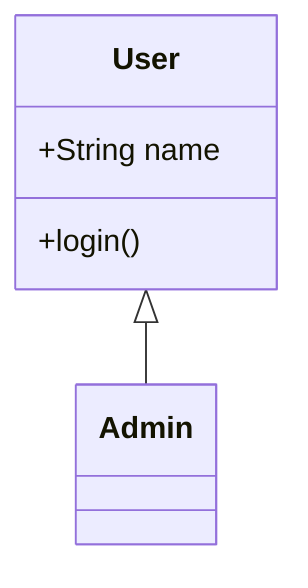
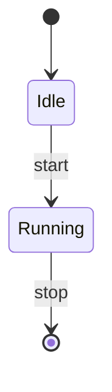
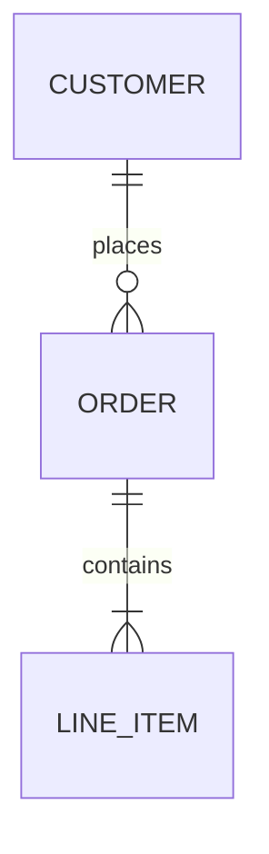
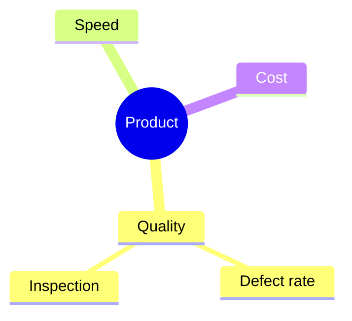

# Diagrams

SlideCraft diagrams are exported as **native shapes that remain editable in PPTX**. They are not pasted in as images, so when you open the exported `.pptx` in PowerPoint, you can tweak the boxes, arrows, and text directly. Because the preview (SVG) and the PPTX are generated from the same rendering logic, what you see is what you get.

There are two ways to author a diagram.

| Method | Notation | Available types |
|---|---|---|
| ` ```diagram ` | **DiagramSpec** (YAML / JSON) | **12 native types** |
| ` ```mermaid ` | Mermaid notation | The 12 types above plus **class / state / ER / mindmap** |

A diagram can take the place of body text on a single slide, and can also be placed inside [column dividers](/en/guide/markdown-authoring) such as `<!-- col -->`.

::: tip Which one should I use?
When in doubt, use ` ```diagram `. It is the canonical format SlideCraft was designed to render natively, and every field described below applies directly. Use the `mermaid` fence when you want to reuse existing Mermaid assets, or when you want to draw `class` / `state` / `ER` / `mindmap`.
:::

---

## The `diagram` fence — 12 native types

Inside a ` ```diagram ` fence, write a **DiagramSpec** with a `type:` in YAML (or JSON).

The following **12 native diagrams** can be authored (the values you specify for `type`):

| `type` | Purpose |
|---|---|
| `flowchart` | Flowchart (boxes, arrows, decision branches) |
| `network` | Network / architecture diagram (nodes with icons) |
| `orgchart` | Org chart, hierarchy, breakdown |
| `sequence` | Sequence diagram (interactions over time) |
| `timeline` | Timeline, chronology, roadmap |
| `quadrant` | Four-quadrant matrix (2×2) |
| `pie` | Pie chart (composition) |
| `gantt` | Gantt chart (schedule) |
| `journey` | Customer journey (with satisfaction scores) |
| `xychart` | Bar / line chart |
| `radar` | Radar chart (multi-axis comparison) |
| `kpi` | KPI cards (large number tiles) |

::: details The 12 types at a glance — node-based vs. chart-based
DiagramSpec has two families.

- **Node-based** (`flowchart` / `network` / `orgchart` / `sequence` / `timeline`) share the vocabulary of `nodes` (`id` / `label` / `shape` / `icon` / `class` / `group` …) and `edges` (`from` / `to` / `label` …).
- **Chart-based** (`quadrant` / `pie` / `gantt` / `xychart` / `radar` / `kpi`) usually set `nodes: []` and write their data in a top-level field dedicated to each `type` (`quadrant:` / `gantt:` / `xychart:` / `radar:` / `kpi:`). (Only `pie` also carries values on its nodes.)

`nodes` is always a required field. When a chart-based diagram does not use nodes, write `nodes: []` explicitly.
:::

Below are minimal examples of all 12 types. Paste them straight into a fence and they render.

### flowchart — Flowchart

Boxes and arrows. `shape` can be `rect` / `rounded_rect` / `diamond` / `circle` / `oval` / `hexagon` (defaults to `rect` when omitted). Adding a `label` to an edge lets you express branch conditions and the like.

```diagram
type: flowchart
direction: LR
nodes:
  - { id: a, label: Start, shape: rounded_rect }
  - { id: b, label: Decision, shape: diamond }
  - { id: c, label: Done }
edges:
  - { from: a, to: b }
  - { from: b, to: c, label: OK }
```

### network — Network diagram

Same structure as `flowchart`, but each node carries an `icon`. Many built-in icons are available, such as `server` / `database` / `cloud`, and they are drawn as native glyphs in PPTX too.

```diagram
type: network
nodes:
  - { id: web, label: Web, icon: server }
  - { id: db,  label: DB,  icon: database }
edges:
  - { from: web, to: db }
```

::: tip Icon names
Many icon names are available (`server` / `database` / `cloud` / `router` / `firewall` / `loadbalancer` / `user` / `storage` …), and aliases are recognized too. When you let the AI generate a diagram, it is given the list of available icons, so an appropriate icon is chosen automatically. → [AI setup](/en/guide/ai-setup)
:::

### orgchart — Org chart

`direction: TB` (top to bottom) draws the hierarchy. Each edge is a "parent → child" reporting line.

```diagram
type: orgchart
direction: TB
nodes:
  - { id: ceo, label: CEO }
  - { id: cto, label: CTO }
  - { id: cfo, label: CFO }
edges:
  - { from: ceo, to: cto }
  - { from: ceo, to: cfo }
```

### sequence — Sequence diagram

`nodes` are the participants, and `edges` are **messages in order** (the position within the array becomes the message index). Optionally you can add `fragments` (`alt` / `loop` / `opt` / `par` enclosing frames) and `activations` (active spans on a lifeline).

```diagram
type: sequence
nodes:
  - { id: u, label: User }
  - { id: s, label: Server }
edges:
  - { from: u, to: s, label: request }
  - { from: s, to: u, label: response }
fragments:
  - { kind: opt, label: if cached, from: 1, to: 1 }
```

::: details Specifying fragments / activations
- `fragments`: `kind` is `alt` / `loop` / `opt` / `par`. `from` / `to` are a range of message indices (0-based, inclusive on both ends). `alt` / `par` can have `dividers` (`else` / `and` divider lines).
- `activations`: `{ participant, from, to }` marks the span in which a specific participant's lifeline is "processing."
- Asynchronous messages (Mermaid's `-)`) are specified on the edge with `style: { async: true }`.
:::

### timeline — Timeline

Arrange `nodes` in chronological order. Grouping consecutive periods with `group:` creates phase bands. No edges are needed.

```diagram
type: timeline
nodes:
  - { id: p1, label: 2023 Planning, group: Phase 1 }
  - { id: p2, label: 2024 Development, group: Phase 1 }
  - { id: p3, label: 2025 Launch, group: Phase 2 }
```

### quadrant — Four-quadrant matrix

Set `nodes: []`, and in the `quadrant` object write the endpoints of each axis (`xLow` / `xHigh` / `yLow` / `yHigh`), the label for each quadrant (`q1` top-right, `q2` top-left, `q3` bottom-left, `q4` bottom-right), and the plotted points (`points`, where `x` / `y` are 0–1).

```diagram
type: quadrant
nodes: []
quadrant:
  xLow: Low cost
  xHigh: High cost
  yLow: Low impact
  yHigh: High impact
  q1: Top priority
  q2: Consider
  q3: Drop
  q4: Runner-up
  points:
    - { label: Initiative A, x: 0.2, y: 0.8 }
```

### pie — Pie chart

Give each node a positive numeric `value`. Slices are drawn in proportion to the values.

```diagram
type: pie
title: Composition
nodes:
  - { id: a, label: Domestic, value: 60 }
  - { id: b, label: Overseas, value: 40 }
```

### gantt — Gantt chart

Set `nodes: []`, and in the `gantt` object write `startDate` and `tasks`. `start` / `end` are the number of days elapsed since `startDate`. `status` is `done` / `active` / `crit` / `milestone`.

```diagram
type: gantt
nodes: []
gantt:
  startDate: 2025-01-01
  tasks:
    - { name: Requirements, section: Design, start: 0,  end: 10, status: done }
    - { name: Implementation,     section: Development, start: 10, end: 30, status: active }
```

### journey — Customer journey

`nodes` are experience steps. `value` is the satisfaction score (1–5), `group` is the section, and `attributes` are the actors involved.

```diagram
type: journey
nodes:
  - { id: s1, label: Search, value: 3, group: Discovery, attributes: [User] }
  - { id: s2, label: Purchase, value: 5, group: Conversion, attributes: [User] }
```

### xychart — Bar / line chart

Set `nodes: []`, and in the `xychart` object write the axis labels, `categories`, and `series`. Each series has `kind: bar` or `kind: line`. `values` must contain the same number of entries as `categories`.

```diagram
type: xychart
nodes: []
xychart:
  xlabel: Quarter
  ylabel: Revenue
  categories: [Q1, Q2, Q3, Q4]
  series:
    - { kind: bar, name: "2024", values: [10, 14, 13, 18] }
```

::: tip Mixing bars and lines
Mixing `kind: bar` and `kind: line` in `series` lets you draw a combo chart (e.g., actuals as bars, targets as a line).
:::

### radar — Radar chart

Set `nodes: []`, and in the `radar` object write `axes` (axis labels), `max` (the maximum axis value), and `series`. Each series' `values` must have the same number of entries as `axes`.

```diagram
type: radar
nodes: []
radar:
  axes: [Speed, Quality, Price, Support]
  max: 5
  series:
    - { name: Us, values: [4, 5, 3, 4] }
    - { name: Competitor, values: [3, 3, 5, 2] }
```

### kpi — KPI cards

Set `nodes: []`, and in the `cards` of the `kpi` object arrange large number tiles. `value` / `delta` are strings (units may be included), and `trend` is `up` / `down`.

```diagram
type: kpi
nodes: []
kpi:
  cards:
    - { value: "¥1.2M", label: Monthly revenue, delta: "+12%", trend: up }
    - { value: "98%",   label: Uptime,   delta: "-1%",  trend: down }
```

---

## The `mermaid` fence — 4 more types

When you write Mermaid notation in a ` ```mermaid ` fence, SlideCraft converts it to a native diagram as far as it can. In addition to the 12 types above, the following 4 types are available **only via `mermaid`**:

| Type | Mermaid notation |
|---|---|
| **class** (class diagram) | `classDiagram` |
| **state** (state diagram) | `stateDiagram-v2` |
| **ER** (ER diagram) | `erDiagram` |
| **mindmap** (mind map) | `mindmap` |

### class — Class diagram

Draws compartments of attributes and methods, along with UML relationships such as inheritance and composition.



### state — State diagram

Using `[*]` as the start/end pseudo-state, draws transitions between states.



### ER — ER diagram

Draws entities and their cardinality in crow's-foot notation (one-to-many, etc.).



### mindmap — Mind map

Draws a hierarchy branching out from a central theme.



::: warning Mermaid that cannot be converted to PPTX
Mermaid diagrams such as `gitGraph` / `sankey` / `C4` (`C4Context` and the like) cannot be mapped to SlideCraft's native shapes, so **they cannot be drawn in PPTX**.

By default, slides containing these are **rejected on PPTX export** (they never disappear silently). Replace them with one of the following:

- Any of the 12 native types (` ```diagram `)
- Convertible Mermaid (`class` / `state` / `ER` / `mindmap`, and notations equivalent to the 12 types)

See the [FAQ](/en/guide/faq) and [output constraints](/en/guide/faq) for details.
:::

---

## Adjusting the design

The **content** of a diagram (what to draw) is written in Markdown (the `diagram` / `mermaid` fence), and the **design** (placement, orientation, emphasis) is adjusted in the visual editor. These two layers are independent, so rewriting the content preserves your design intent.

- **Orientation** — `direction: TB / LR / BT / RL` (node-based) changes the overall flow direction.
- **Grouping** — Add `group:` to nodes and define frames in `groups:` to bundle them within a dotted frame (nesting is allowed up to 3 levels deep).
- **Class styles** — Define named styles (fill, border, font) in `classDefs:` and reference them from a node's `class:` to specify the look of multiple nodes at once.
- **Manual placement** — Dragging and resizing a node in the preview saves the result as that node's `override` (absolute coordinates).

::: tip Let the AI handle it
Diagrams can be generated in two stages: "decide the type → generate with instructions specific to that type." This makes it more likely you get the type of diagram you intended, and natural-language edits to an existing diagram ("change the orientation from vertical to horizontal," "emphasize this node," etc.) can be applied only after being validated by the adoption gate. → [AI setup](/en/guide/ai-setup) / [MCP](/en/guide/mcp)
:::

---

## Troubleshooting

**The diagram does not render**
: There may be a syntax error in the YAML / JSON of your `diagram` fence. The editor shows the reason, so check `type:` and the required fields for that type (see each example on this page). Reference errors are also detected, such as an edge referencing a nonexistent node ID or a duplicate node ID.

**A chart-based diagram says "no nodes"**
: `nodes` is always required. When drawing `quadrant` / `gantt` / `xychart` / `radar` / `kpi`, write `nodes: []` explicitly.

**A Mermaid diagram cannot be turned into PPTX**
: `gitGraph` / `sankey` / `C4` are not convertible. As noted in the warning above, replace them with a supported diagram.

Related pages: [Markdown](/en/guide/markdown-authoring) · [Templates](/en/guide/templates) · [AI setup](/en/guide/ai-setup) · [FAQ](/en/guide/faq)
