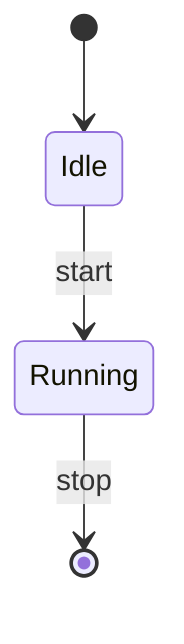

# FAQ / Troubleshooting

Here's a roundup of the common pitfalls you might hit while using SlideCraft, along with how to fix them.
Each entry is organized as "symptom → cause → fix." Where a fuller explanation exists, each entry
links out to it.

::: tip How to search
Use your browser's in-page search (Ctrl/Cmd + F) and type a keyword from your symptom
(e.g. "body text", "overflow", "mac") to jump straight to the relevant entry.
:::

---

## Images

### An image shows up as body text instead of becoming an image

**Cause**: SlideCraft only embeds an image when it's a **data URI (`data:image/...;base64,...`)**.
Remote URLs (`https://…`), local paths (`./logo.png` or `C:\...`), `javascript:`, and the like are,
for safety, not turned into images and are treated as plain **body text** instead.

**Fix**: Convert the image to a data URI before pasting it in.

```markdown
# ロゴ


```

Once it's a data URI, it shows up everywhere — preview, HTML output, and PPTX output
(in PPTX it's decoded and embedded as media). For the details of the syntax, see the
[Markdown Authoring Guide](/en/guide/markdown-authoring).

::: warning Why are URLs rejected?
Automatically fetching external URLs or local paths could lead to unintended network requests or
path leakage. "Data URIs only" is by design, not a bug.
:::

### The position or size of an image isn't what I expected

Add attributes to the end of an image line to control its position, size, cropping, and stacking order.

```markdown
{x=0,y=0,w=13.33,h=7.5,fit=cover,behind=1}
```

- `x` / `y` / `w` / `h` … position and size, in inches
- `fit=cover` / `fit=contain` … how to crop the image relative to its frame
- `ar=…` … aspect ratio
- `behind=1` … place it in the very back (behind the body content)

You can also drag to move and resize the image in the visual editor, and the result is saved back into the Markdown as these attributes.

---

## Diagrams

### A diagram doesn't render

**Cause**: The YAML/JSON inside the ` ```diagram ` fence has a syntax error, or a required field is missing.

**Fix**:

1. Check that `type:` is specified (one of the 12 types).
2. Check that the required fields for that type (`nodes` / `edges`, etc.) are all present.
3. The editor shows why it can't render, so follow that message to fix it.

A minimal example (flowchart):

```diagram
type: flowchart
direction: LR
nodes:
  - { id: a, label: 開始 }
  - { id: b, label: 完了 }
edges:
  - { from: a, to: b }
```

The syntax and a minimal example for each type are collected in [Diagrams](/en/guide/diagrams).

### A Mermaid diagram won't appear / can't be turned into PPTX

**Cause**: Among Mermaid diagrams, **`gitGraph` / `sankey` / `C4` and the like can't be converted to PPTX**.
These are rejected at PPTX export time (they never silently disappear).

**Fix**: Replace them with a supported diagram.

- The **12 native types** (the ` ```diagram ` fence): `flowchart` / `network` / `orgchart` /
  `sequence` / `timeline` / `quadrant` / `pie` / `gantt` / `journey` / `xychart` / `radar` / `kpi`
- The **4 types** available only via the ` ```mermaid ` fence: `class` / `state` / `ER` / `mindmap`



For the list of replacements and whether each can be converted, see [Diagrams](/en/guide/diagrams).

::: details What exactly does "can't be converted" look like?
Convertible Mermaid diagrams automatically become native diagrams (editable shapes).
Slides containing `gitGraph` / `sankey` / `C4` and the like have their PPTX export rejected by default,
so you'll know you need to replace them before exporting. Don't be lulled by the preview showing them —
switch to one of the supported types above.
:::

---

## Launch & installation

### macOS says the app is "damaged" and won't open

**Cause**: The macOS build is ad-hoc signed (not notarized), so Gatekeeper shows a warning.

**Fix**: The cleanest route is via the Homebrew cask.

```bash
brew install --cask zyuuryuu/slidecraft/slidecraft
```

`brew` strips the quarantine attribute on install, so it opens without a first-launch warning.
If you downloaded the `.dmg` directly, either **right-click → "Open"** the first time only, or run:

```bash
xattr -dr com.apple.quarantine /Applications/SlideCraft.app
```

Installation methods by OS are collected in the [Installation Guide](/en/guide/installation).

### It won't install properly on Windows / Linux

Get the distribution installers from [Releases](https://github.com/zyuuryuu/slidecraft/releases).
On Windows use the `.msi`; on Linux use the `.AppImage` (mark it executable and launch it) or the `.deb`.
For details, see the [Installation Guide](/en/guide/installation).

---

## Layout & body text

### Body text overflows the slide / the font gets small

**Cause**: You've put more text on a single slide than can fit.

**Fix**: SlideCraft's engine **splits overflow deterministically** (dividing the content across multiple slides).
If it's still too packed even then, cut down the content with one of the following:

- Summarize the content (by hand, or ask the built-in AI → [AI Setup Guide](/en/guide/ai-setup))
- Tidy up the bullets and aim for one message per slide
- Convert scannable data into a **GFM table** (it becomes an editable native table)

```markdown
| 項目 | 旧プラン | 新プラン |
|------|---------|---------|
| 料金 | ¥1,000  | ¥800    |
| 容量 | 10 GB   | 30 GB   |
```

::: tip Template fonts are never shrunk
SlideCraft does not "shrink the template's font to force everything in."
To keep the look intact, its policy is to add more slides for whatever doesn't fit. For details, see the
[Markdown Authoring Guide](/en/guide/markdown-authoring).
:::

### The title or body doesn't land in the frame I intended

**Cause**: If the frame roles on the template side (title frame, body frame) are broken, content can't flow in correctly.

**Fix**: During the intake diagnostics, use "Import with cleanup" (a minimal repair offer) to
fill in the frame roles and turn the template into a form that can be accepted. Importing, repairing, and
creating templates are covered in [Templates](/en/guide/templates).

---

## AI & agent integration

### I want to use it from an AI agent (Claude Desktop / Claude Code, etc.)

**Fix**: You can connect via `slidecraft serve` (a stdio MCP server). For how to connect and the list of tools, see the
[MCP Guide](/en/guide/mcp). The MCP server itself sends nothing to the cloud or to any LLM.

### The built-in AI (offline) doesn't work / the model won't download

The built-in AI is a llamafile sidecar that, on first use, **automatically downloads** a model
matched to your environment (RAM, CPU core count) — just once. Enabling it, tiers, how to stop it, and more are
covered in the [AI Setup Guide](/en/guide/ai-setup). The AI starts automatically when you generate, and
when you're done you can free the memory with "Stop."

---

## Output

### I get the feeling the diagrams and tables in the PPTX are pasted as images

They aren't. In SlideCraft's PPTX output, diagrams and tables are written out as **editable native shapes**,
so you can tweak them directly in PowerPoint (they're not rasterized images).
The only thing embedded as media is an **image** you inlined as a data URI.
For the details of output, see [Two-Stage Editing and Export](/en/guide/editing-and-export).

### Printing the standalone HTML breaks the layout

Standalone HTML is built so that **printing gives you one slide = one page**.
If it breaks, set your browser's print dialog to landscape orientation, margins to "none/minimum," and
scale to 100% ("fit to page" off).

---

## License

SlideCraft is provided under the **Apache License 2.0**. For attribution of third-party components, bundled binaries,
and AI model weights downloaded at runtime, see the repository's `NOTICE` and
`THIRD-PARTY-NOTICES.md`.

---

If this doesn't solve your problem, let us know via [Reporting Issues](/en/guide/reporting-issues) with steps to reproduce.
