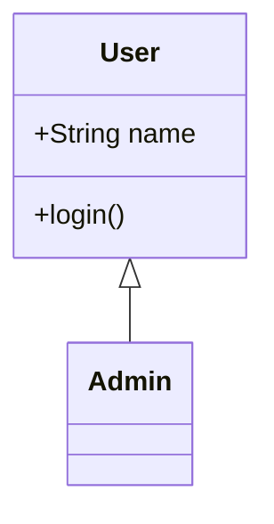
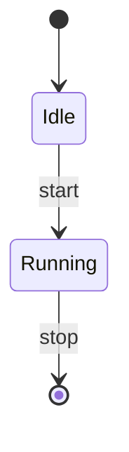
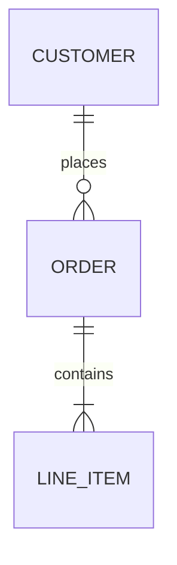
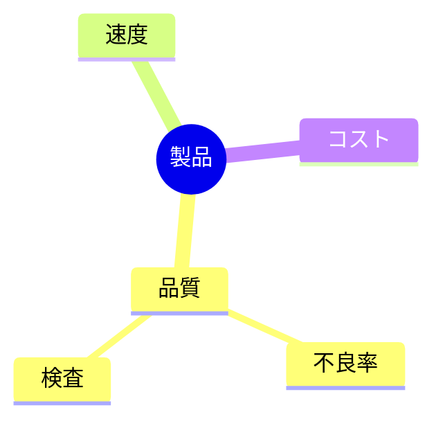

# 図（ダイアグラム）

SlideCraft の図は、**PPTX 上でも編集可能なネイティブ図形**として出力されます。画像として貼り付けるのではないので、書き出した `.pptx` を PowerPoint で開けば、箱・矢印・テキストをそのまま手直しできます。プレビュー（SVG）と PPTX は同じ描画ロジックから生成されるため、見たままの結果になります。

図の書き方は 2 通りあります。

| 書き方 | 記法 | 使える種類 |
|---|---|---|
| ` ```diagram ` | **DiagramSpec**（YAML / JSON） | ネイティブ **12 種** |
| ` ```mermaid ` | Mermaid 記法 | 上記 12 種に相当するもの＋ **class / state / ER / mindmap** |

図は本文の代わりとして 1 スライドに置けるほか、`<!-- col -->` などの[カラム区切り](/guide/markdown-authoring)の中にも置けます。

::: tip どちらを使うべきか
迷ったら ` ```diagram ` を使ってください。SlideCraft がネイティブに描くために設計した正準フォーマットで、後述の全フィールドがそのまま効きます。`mermaid` フェンスは、既存の Mermaid 資産を再利用したい場合や、`class` / `state` / `ER` / `mindmap` を描きたい場合に使います。
:::

---

## `diagram` フェンス — ネイティブ 12 種

` ```diagram ` の中に、`type:` を持つ **DiagramSpec** を YAML（または JSON）で書きます。

著作できるネイティブ図は次の **12 種**です（`type` に指定する値）：

| `type` | 用途 |
|---|---|
| `flowchart` | フローチャート（箱と矢印・判定分岐） |
| `network` | ネットワーク／構成図（アイコン付きノード） |
| `orgchart` | 組織図・階層・内訳 |
| `sequence` | シーケンス図（時系列のやり取り） |
| `timeline` | タイムライン・年表・ロードマップ |
| `quadrant` | 四象限マトリクス（2×2） |
| `pie` | 円グラフ（構成比） |
| `gantt` | ガントチャート（スケジュール） |
| `journey` | カスタマージャーニー（満足度つき） |
| `xychart` | 棒／折れ線グラフ |
| `radar` | レーダーチャート（多軸比較） |
| `kpi` | KPI カード（大きな数字タイル） |

::: details 12 種の全体像 — ノード系とチャート系
DiagramSpec には 2 系統があります。

- **ノード系**（`flowchart` / `network` / `orgchart` / `sequence` / `timeline`）は `nodes`（`id` / `label` / `shape` / `icon` / `class` / `group` …）と `edges`（`from` / `to` / `label` …）の語彙を共有します。
- **チャート系**（`quadrant` / `pie` / `gantt` / `xychart` / `radar` / `kpi`）は多くの場合 `nodes: []` にして、`type` ごとの専用トップレベルフィールド（`quadrant:` / `gantt:` / `xychart:` / `radar:` / `kpi:`）にデータを書きます（`pie` だけはノードにも値を持たせます）。

`nodes` は常に必須フィールドです。チャート系でノードを使わない場合は明示的に `nodes: []` と書いてください。
:::

以下、12 種すべての最小例です。そのままフェンスに貼れば描画されます。

### flowchart — フローチャート

箱と矢印。`shape` は `rect` / `rounded_rect` / `diamond` / `circle` / `oval` / `hexagon` から選べます（省略時は `rect`）。エッジに `label` を付けると分岐条件などを表せます。

```diagram
type: flowchart
direction: LR
nodes:
  - { id: a, label: 開始, shape: rounded_rect }
  - { id: b, label: 判定, shape: diamond }
  - { id: c, label: 完了 }
edges:
  - { from: a, to: b }
  - { from: b, to: c, label: OK }
```

### network — ネットワーク図

`flowchart` と同じ構造ですが、各ノードに `icon` を付けます。`server` / `database` / `cloud` など多数の組み込みアイコンが使え、PPTX でもネイティブなグリフとして描かれます。

```diagram
type: network
nodes:
  - { id: web, label: Web, icon: server }
  - { id: db,  label: DB,  icon: database }
edges:
  - { from: web, to: db }
```

::: tip アイコン名
利用できるアイコン名は多数あり（`server` / `database` / `cloud` / `router` / `firewall` / `loadbalancer` / `user` / `storage` …）、別名も認識されます。図の生成を AI に任せる場合、AI には利用可能なアイコン一覧が渡されるため、適切なアイコンが自動で選ばれます。→ [AI設定](/guide/ai-setup)
:::

### orgchart — 組織図

`direction: TB`（上から下）で階層を描きます。各エッジは「親 → 子」のレポートラインです。

```diagram
type: orgchart
direction: TB
nodes:
  - { id: ceo, label: CEO }
  - { id: cto, label: CTO }
  - { id: cfo, label: CFO }
edges:
  - { from: ceo, to: cto }
  - { from: ceo, to: cfo }
```

### sequence — シーケンス図

`nodes` は登場者（参加者）、`edges` は**順番通りのメッセージ**です（配列内の位置がメッセージのインデックスになります）。任意で `fragments`（`alt` / `loop` / `opt` / `par` の囲み枠）や `activations`（ライフラインの活性区間）を付けられます。

```diagram
type: sequence
nodes:
  - { id: u, label: User }
  - { id: s, label: Server }
edges:
  - { from: u, to: s, label: request }
  - { from: s, to: u, label: response }
fragments:
  - { kind: opt, label: if cached, from: 1, to: 1 }
```

::: details fragment / activation の指定
- `fragments`：`kind` は `alt` / `loop` / `opt` / `par`。`from` / `to` はメッセージインデックス（0 始まり・両端含む）の範囲。`alt` / `par` は `dividers`（`else` / `and` の区切り線）を持てます。
- `activations`：`{ participant, from, to }` で、特定参加者のライフラインが「処理中」の区間を示します。
- 非同期メッセージ（Mermaid の `-)`）はエッジ側で `style: { async: true }` を指定します。
:::

### timeline — タイムライン

`nodes` を時系列順に並べます。連続する期を `group:` でまとめるとフェーズ帯になります。エッジは不要です。

```diagram
type: timeline
nodes:
  - { id: p1, label: 2023 企画, group: Phase 1 }
  - { id: p2, label: 2024 開発, group: Phase 1 }
  - { id: p3, label: 2025 公開, group: Phase 2 }
```

### quadrant — 四象限マトリクス

`nodes: []` とし、`quadrant` オブジェクトに軸の両端（`xLow` / `xHigh` / `yLow` / `yHigh`）、各象限のラベル（`q1` 右上・`q2` 左上・`q3` 左下・`q4` 右下）、プロット点（`points`、`x` / `y` は 0〜1）を書きます。

```diagram
type: quadrant
nodes: []
quadrant:
  xLow: 低コスト
  xHigh: 高コスト
  yLow: 低効果
  yHigh: 高効果
  q1: 最優先
  q2: 要検討
  q3: 見送り
  q4: 次点
  points:
    - { label: 施策A, x: 0.2, y: 0.8 }
```

### pie — 円グラフ

各ノードに正の数値 `value` を持たせます。値の比率で扇形が描かれます。

```diagram
type: pie
title: 構成比
nodes:
  - { id: a, label: 国内, value: 60 }
  - { id: b, label: 海外, value: 40 }
```

### gantt — ガントチャート

`nodes: []` とし、`gantt` オブジェクトに `startDate` と `tasks` を書きます。`start` / `end` は `startDate` からの経過日数。`status` は `done` / `active` / `crit` / `milestone`。

```diagram
type: gantt
nodes: []
gantt:
  startDate: 2025-01-01
  tasks:
    - { name: 要件定義, section: 設計, start: 0,  end: 10, status: done }
    - { name: 実装,     section: 開発, start: 10, end: 30, status: active }
```

### journey — カスタマージャーニー

`nodes` は体験ステップ。`value` は満足度（1〜5）、`group` はセクション、`attributes` は関与するアクターです。

```diagram
type: journey
nodes:
  - { id: s1, label: 検索, value: 3, group: 発見, attributes: [ユーザー] }
  - { id: s2, label: 購入, value: 5, group: 転換, attributes: [ユーザー] }
```

### xychart — 棒／折れ線グラフ

`nodes: []` とし、`xychart` オブジェクトに軸ラベル・`categories`・`series` を書きます。各シリーズは `kind: bar` または `kind: line`。`values` は `categories` と同じ個数を並べます。

```diagram
type: xychart
nodes: []
xychart:
  xlabel: 四半期
  ylabel: 売上
  categories: [Q1, Q2, Q3, Q4]
  series:
    - { kind: bar, name: "2024", values: [10, 14, 13, 18] }
```

::: tip 棒と折れ線の混在
`series` に `kind: bar` と `kind: line` を混ぜれば、複合グラフ（実績を棒・目標を折れ線 など）が描けます。
:::

### radar — レーダーチャート

`nodes: []` とし、`radar` オブジェクトに `axes`（軸ラベル）・`max`（軸の最大値）・`series` を書きます。各シリーズの `values` は `axes` と同じ個数。

```diagram
type: radar
nodes: []
radar:
  axes: [速度, 品質, 価格, 対応]
  max: 5
  series:
    - { name: 自社, values: [4, 5, 3, 4] }
    - { name: 競合, values: [3, 3, 5, 2] }
```

### kpi — KPI カード

`nodes: []` とし、`kpi` オブジェクトの `cards` に大きな数字タイルを並べます。`value` / `delta` は文字列（単位込みで可）、`trend` は `up` / `down`。

```diagram
type: kpi
nodes: []
kpi:
  cards:
    - { value: "¥1.2M", label: 月間売上, delta: "+12%", trend: up }
    - { value: "98%",   label: 稼働率,   delta: "-1%",  trend: down }
```

---

## `mermaid` フェンス — さらに 4 種

` ```mermaid ` に Mermaid 記法を書くと、SlideCraft が可能な範囲でネイティブ図に変換します。上の 12 種に加えて、**`mermaid` 経由でのみ**次の 4 種が使えます：

| 種類 | Mermaid 記法 |
|---|---|
| **class**（クラス図） | `classDiagram` |
| **state**（状態遷移図） | `stateDiagram-v2` |
| **ER**（ER 図） | `erDiagram` |
| **mindmap**（マインドマップ） | `mindmap` |

### class — クラス図

属性・メソッドのコンパートメントと、継承・合成などの UML 関係を描きます。



### state — 状態遷移図

`[*]` を開始／終了の擬似状態として、状態間の遷移を描きます。



### ER — ER 図

エンティティと、crow's-foot 記法のカーディナリティ（1 対多など）を描きます。



### mindmap — マインドマップ

中心テーマから枝分かれする階層を描きます。



::: warning PPTX に変換できない Mermaid
`gitGraph` / `sankey` / `C4`（`C4Context` など）といった Mermaid は、SlideCraft のネイティブ図形にマッピングできないため **PPTX に描けません**。

これらを含むスライドは、既定では **PPTX 出力時に拒否されます**（無言で消えることはありません）。対応する図に置き換えてください：

- ネイティブ 12 種のいずれか（` ```diagram `）
- 変換可能な Mermaid（`class` / `state` / `ER` / `mindmap`、および 12 種に相当する記法）

詳細は [FAQ](/guide/faq) と[出力の制約](/guide/faq)を参照してください。
:::

---

## デザインの調整

図の**内容**（何を描くか）は Markdown（`diagram` / `mermaid` フェンス）で、**デザイン**（配置・向き・強調）は視覚エディタで調整します。この 2 層は独立しており、内容を書き換えてもデザインの意図は保たれます。

- **向き** — `direction: TB / LR / BT / RL`（ノード系）で全体の流れる方向を変えられます。
- **グルーピング** — ノードに `group:` を付け、`groups:` に枠を定義すると、点線枠でまとめられます（最大 3 階層までネスト可）。
- **クラススタイル** — `classDefs:` に名前付きスタイル（塗り・枠・フォント）を定義し、ノードの `class:` から参照すると、複数ノードの見た目をまとめて指定できます。
- **手動配置** — プレビュー上でノードをドラッグ移動・リサイズすると、その結果が各ノードの `override`（絶対座標）として保存されます。

::: tip AI に任せる
図は「タイプを決める → そのタイプ専用の指示で生成」という二段構えで生成できます。狙った種類の図が出やすく、既存の図に対する自然言語での修正（「向きを縦→横に」「このノードを強調」など）も、採用ゲートで検証してから反映できます。→ [AI設定](/guide/ai-setup) / [MCP](/guide/mcp)
:::

---

## トラブルシューティング

**図が描画されない**
: `diagram` フェンスの YAML / JSON に構文エラーがある可能性があります。エディタが理由を表示するので、`type:` と、その種類の必須フィールド（本ページの各例）を確認してください。エッジが存在しないノード ID を参照している、ノード ID が重複している、といった参照エラーも検出されます。

**チャート系で「nodes がない」と言われる**
: `nodes` は常に必須です。`quadrant` / `gantt` / `xychart` / `radar` / `kpi` を描くときも、明示的に `nodes: []` と書いてください。

**Mermaid の図が PPTX にできない**
: `gitGraph` / `sankey` / `C4` は変換対象外です。上の警告のとおり、対応する図に置き換えてください。

関連ページ： [Markdown](/guide/markdown-authoring) ・ [テンプレート](/guide/templates) ・ [AI設定](/guide/ai-setup) ・ [FAQ](/guide/faq)
