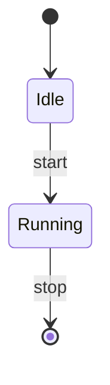

# FAQ / トラブルシューティング

SlideCraft を使っていてつまずきやすいポイントと、その対処をまとめました。
「症状 → 原因 → 直し方」の順で読めるように並べています。関連する詳しい説明には
各項目からリンクを張ってあります。

::: tip 探し方
ブラウザ内検索（Ctrl/Cmd + F）で症状のキーワード（例: 「本文」「あふれる」「mac」）を
打ち込むと目的の項目に飛べます。
:::

---

## 画像まわり

### 画像が本文テキストとして表示され、画像にならない

**原因**：SlideCraft が画像として埋め込むのは、**データ URI（`data:image/...;base64,...`）だけ**です。
リモート URL（`https://…`）・ローカルパス（`./logo.png` や `C:\...`）・`javascript:` などは、
安全のため画像化されず、そのまま**本文テキスト**として扱われます。

**直し方**：画像をデータ URI に変換してから貼り込みます。

```markdown
# ロゴ


```

データ URI にすると、プレビュー・HTML 出力・PPTX 出力のすべてに反映されます
（PPTX ではデコードされてメディアとして貼り込まれます）。記法の詳細は
[Markdown 執筆ガイド](/guide/markdown-authoring)を参照してください。

::: warning なぜ URL は弾かれるのか
外部 URL やローカルパスを自動で取りに行くと、意図しない通信やパス漏えいにつながります。
「データ URI のみ」は仕様であり不具合ではありません。
:::

### 画像の位置やサイズが思った通りにならない

画像行の末尾に属性を付けると、位置・サイズ・切り抜き・重ね順を指定できます。

```markdown
{x=0,y=0,w=13.33,h=7.5,fit=cover,behind=1}
```

- `x` / `y` / `w` / `h` … インチ単位の位置・サイズ
- `fit=cover` / `fit=contain` … 枠に対する切り抜き方法
- `ar=…` … アスペクト比
- `behind=1` … 最背面（本文の後ろ）に敷く

視覚エディタ上でドラッグ移動・リサイズもでき、その結果がこの属性として Markdown に保存されます。

---

## 図（ダイアグラム）まわり

### 図が描画されない

**原因**：` ```diagram ` フェンス内の YAML/JSON に構文エラーがあるか、必須フィールドが欠けています。

**直し方**：

1. `type:` が指定されているか確認する（12 種のいずれか）。
2. そのタイプの必須フィールド（`nodes` / `edges` など）が揃っているか確認する。
3. エディタが描画できない理由を表示するので、そのメッセージに従って修正する。

最小の例（フローチャート）：

```diagram
type: flowchart
direction: LR
nodes:
  - { id: a, label: 開始 }
  - { id: b, label: 完了 }
edges:
  - { from: a, to: b }
```

各タイプの書き方と最小例は[図（ダイアグラム）](/guide/diagrams)にまとまっています。

### Mermaid の図が出ない／PPTX にできない

**原因**：Mermaid のうち **`gitGraph` / `sankey` / `C4` などは PPTX に変換できません**。
これらは PPTX 出力時に拒否されます（無言で消えることはありません）。

**直し方**：対応する図に置き換えます。

- ネイティブ **12 種**（` ```diagram ` フェンス）：`flowchart` / `network` / `orgchart` /
  `sequence` / `timeline` / `quadrant` / `pie` / `gantt` / `journey` / `xychart` / `radar` / `kpi`
- ` ```mermaid ` フェンス経由でのみ使える **4 種**：`class` / `state` / `ER` / `mindmap`



置き換え先の一覧と変換可否は[図（ダイアグラム）](/guide/diagrams)を参照してください。

::: details 「変換不能」は具体的にどうなる？
変換可能な Mermaid は自動でネイティブ図（編集可能な図形）になります。
`gitGraph` / `sankey` / `C4` などを含むスライドは、既定では PPTX 出力が拒否されるため、
出力前に置き換えが必要だと分かります。プレビューに出ていても油断せず、上記の対応種へ寄せてください。
:::

---

## 起動・インストール

### macOS で「壊れている」と出て開けない

**原因**：macOS 版は ad-hoc 署名（ノータライズなし）のため、Gatekeeper が警告を出します。

**直し方**：もっともクリーンなのは Homebrew cask 経由です。

```bash
brew install --cask zyuuryuu/slidecraft/slidecraft
```

`brew` はインストール時に quarantine 属性を剥がすので、初回起動の警告なしで開けます。
`.dmg` を直接ダウンロードした場合は、初回のみ **右クリック →「開く」**、または次を実行します。

```bash
xattr -dr com.apple.quarantine /Applications/SlideCraft.app
```

OS 別の入手方法は[インストールガイド](/guide/installation)にまとまっています。

### Windows / Linux でうまく入らない

配布インストーラは [Releases](https://github.com/zyuuryuu/slidecraft/releases) から入手します。
Windows は `.msi`、Linux は `.AppImage`（実行権限を付けて起動）または `.deb` を使います。
詳細は[インストールガイド](/guide/installation)を参照してください。

---

## レイアウト・本文

### 本文がスライドからあふれる／フォントが小さくなる

**原因**：1 枚のスライドに収まりきらない量のテキストを入れています。

**直し方**：SlideCraft のエンジンは**決定論的にあふれを分割**します（内容を複数スライドに割る）。
それでも詰め込みすぎな場合は、次のいずれかで内容を減らします。

- 内容を要約する（手動、または内蔵 AI に依頼する → [支援AI設定ガイド](/guide/ai-setup)）
- 箇条書きを整理し、1 スライド 1 メッセージに寄せる
- 一覧性のあるデータは **GFM 表**に変換する（編集可能なネイティブ表になります）

```markdown
| 項目 | 旧プラン | 新プラン |
|------|---------|---------|
| 料金 | ¥1,000  | ¥800    |
| 容量 | 10 GB   | 30 GB   |
```

::: tip テンプレートのフォントは縮めない
SlideCraft は「テンプレートのフォントを小さくして無理に収める」ことはしません。
見た目を崩さないため、収まらない分はスライドを増やす方針です。詳しくは
[Markdown 執筆ガイド](/guide/markdown-authoring)を参照してください。
:::

### タイトルや本文が意図した枠に入らない

**原因**：テンプレート側で枠の役割（タイトル枠・本文枠）が壊れていると、正しく流し込めません。

**直し方**：取り込み時の診断で「整形して取り込む」（最小限の修復オファー）を使うと、
枠の役割を補って受け入れられる形に直せます。テンプレートの取り込み・修復・新規作成は
[テンプレート](/guide/templates)を参照してください。

---

## AI・エージェント連携

### AI エージェント（Claude Desktop / Claude Code など）から使いたい

**直し方**：`slidecraft serve`（stdio MCP サーバ）で連携できます。接続方法とツール一覧は
[MCP ガイド](/guide/mcp)を参照してください。MCP サーバ自身はクラウドにも LLM にも送信しません。

### 内蔵 AI（オフライン）が動かない／モデルが落ちてこない

内蔵 AI は llamafile サイドカーで、初回に環境（RAM・CPU コア数）に応じたモデルを
**自動ダウンロード**します（一度だけ）。有効化・ティア・停止方法などは
[支援AI設定ガイド](/guide/ai-setup)にまとまっています。生成時に AI は自動起動し、
使い終わったら「停止」でメモリを解放できます。

---

## 出力

### PPTX の図や表が画像として貼られている気がする

そうではありません。SlideCraft の PPTX 出力では、図・表は**編集可能なネイティブ図形**として
書き出されるため、PowerPoint 側でそのまま手直しできます（ラスタライズされた画像ではありません）。
唯一、データ URI で埋め込んだ**画像**だけがメディアとして貼り込まれます。
出力の詳細は[二段階編集と出力](/guide/editing-and-export)を参照してください。

### スタンダロン HTML を印刷するとレイアウトが崩れる

スタンダロン HTML は**印刷すると 1 スライド＝1 ページ**になるよう作られています。
崩れる場合は、ブラウザの印刷ダイアログで用紙向きを横（Landscape）、余白を「なし／最小」に、
拡大縮小を 100%（「ページに合わせる」off）に設定してください。

---

## ライセンス

SlideCraft は **Apache License 2.0** で提供されます。第三者コンポーネント・同梱バイナリ・
実行時にダウンロードする AI モデル重みの帰属表示は、リポジトリの `NOTICE` /
`THIRD-PARTY-NOTICES.md` を参照してください。

---

解決しない場合は[問題の報告](/guide/reporting-issues)から再現手順を添えてお知らせください。
