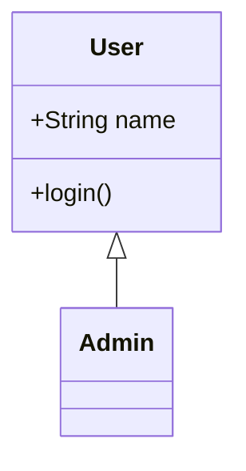
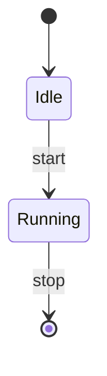

# SlideCraft ユーザーガイド

**スライドマスターからデザインを受け継ぎ、これまでと変わらない編集のしやすさで、
人が作ったと見分けのつかないスライドを。** それが SlideCraft です。

Markdown で書いたスライドを、会社のテンプレート（PowerPoint の見た目）に流し込んで
`.pptx` を作るデスクトップアプリです。テキストは Markdown で書き、配置や装飾はテンプレートと
エンジンにまかせる——という分業で、フォントやレイアウトを崩さずに整ったスライドが作れます。

- **書く** — Markdown（見出し・箇条書き・表・図など）
- **見る／直す** — テンプレートの色・フォントを反映したプレビューで、内容とデザインを分けて手直し
- **出す** — 編集可能な図形で構成された `.pptx`、または遷移つきスタンダロン HTML

内蔵のオフライン AI（後述）や、上流の AI エージェント連携（MCP）にも対応します。

---

## 1. これは何か / インストール

### 動作環境と入手

配布インストーラを [Releases](https://github.com/zyuuryuu/slidecraft/releases) から入手します。

| OS | インストーラ | 手順 |
|---|---|---|
| Windows | `.msi` | ダウンロードして実行 |
| Linux | `.AppImage` / `.deb` | AppImage は実行権限を付けて起動、または deb を導入 |
| macOS | Homebrew cask 推奨 | 下記コマンド |

macOS は ad-hoc 署名（ノータライズなし）のため、**Homebrew tap 経由が最もクリーン**です：

```bash
brew install --cask zyuuryuu/slidecraft/slidecraft
```

`brew` はインストール時に quarantine 属性を剥がすので、初回起動の警告なしで開けます。
`.dmg` を直接ダウンロードした場合は、初回のみ右クリック →「開く」、または
`xattr -dr com.apple.quarantine /Applications/SlideCraft.app` を実行してください。

> ソースから動かす場合は Node.js 20+ と Rust 1.70+ が必要です（`npm install` → `npm run tauri dev`）。
> 通常のご利用では不要です。

---

## 2. 基本の流れ

1. **Draft（下書き）** — 起動して Markdown を入力（新規は Initialize モーダル、既存ファイルの読み込みも可）。
2. **スライドにする** — テンプレートを選び、Markdown を解析してスライド（デッキ）に変換。
   エンジンが各スライドに最適なレイアウトを自動選択し、テンプレートの装飾を適用します。
3. **視覚エディタで確認・調整** — 左のサムネイル一覧から各スライドを選び、見たままのプレビューで確認。
   スライドの追加・複製・削除・ドラッグ並べ替え、内容/デザインの二段階編集ができます。
4. **出力** — `.pptx`（PowerPoint）または スタンダロン HTML を書き出します。作業状態は
   `.scft` プロジェクトファイルとして保存・再開できます。

Markdown（入力）とデッキ（真実）は同じ内容を行き来できます。基本は視覚エディタが主面で、
Markdown はいつでも入力・書き出しに使えます。

---

## 3. Markdown 記法

SlideCraft は Markdown を「1 スライド分ずつ」のブロックに区切って解釈します。

### スライド区切り `---`

`---`（水平線）で 1 枚のスライドを区切ります。

```markdown
# 最初のスライド

- ポイント1
- ポイント2

---

# 次のスライド

本文テキスト。
```

### タイトル・サブタイトル・本文

- `# 見出し` → スライドのタイトル
- `## 見出し` または `> 引用` → サブタイトル
- 箇条書き（`- ` / `* `）や段落 → 本文
- `### 見出し` → グループ（カード/ステップ）内の小見出し
- `**太字**` / `*斜体*` → インライン装飾

タイトルスライドでは `Category:` / `Date:` / `Footer:` の行がメタ情報として扱われます。

```markdown
# 2026年 事業計画
> 第2四半期レビュー

Category: 経営会議
Date: 2026-07-07
```

### レイアウト指定（任意）

先頭行に `<!-- slide: レイアウト名 -->` を書くと、自動選択の代わりに特定レイアウトを使えます。
通常は省略して自動選択（`auto`）にまかせて構いません。

### GFM 表

標準的な GFM の表は、画像ではなく**ネイティブな PPTX 表**（編集可能なセル）になります。

```markdown
# 比較表

| 項目 | 旧プラン | 新プラン |
|------|---------|---------|
| 料金 | ¥1,000  | ¥800    |
| 容量 | 10 GB   | 30 GB   |
```

### 画像 ``

画像は**データ URI（`data:image/...;base64,...`）のみ**が埋め込み画像になります。
リモート URL やローカルパス、`javascript:` などは安全のため画像化されず、本文テキストとして扱われます。
画像はプレビューにも HTML にも自動で入り、PPTX ではデコードされてメディアとして貼り込まれます。

```markdown
# ロゴ


```

画像行の末尾に `{x=…,y=…,w=…,h=…,fit=cover,ar=…,behind=1}` を付けると、
位置・サイズ・切り抜き（`cover`/`contain`）・最背面（`behind=1`）を指定できます
（視覚エディタ上でドラッグ移動・リサイズも可能で、その結果がこの属性として保存されます）。

### 多カラム / KPI / ステップの区切りコメント

本文を複数の領域に分けたいときは、区切りコメントを使います。1 枚のスライド内で
`# タイトル` の後に区切りコメントを並べ、その間に各領域の内容を書きます。

| 区切り | 用途 |
|---|---|
| `<!-- col -->` | 横並びの複数カラム |
| `<!-- kpi -->` | KPI（大きな数字）タイル |
| `<!-- step -->` | プロセス／手順ステップ |
| `<!-- card -->` | カード |

```markdown
# 3本柱

<!-- col -->
### 品質
- 不良率を半減

<!-- col -->
### 速度
- リードタイム短縮

<!-- col -->
### コスト
- 原価 10% 削減
```

各カラムには本文の代わりに図（後述の `diagram`/`mermaid` フェンス）を置くこともできます。

### スピーカーノート `<!-- note -->`

`<!-- note -->` を単独行で置くと、そこから**スライド末尾（次の `---`）まで**がスピーカーノートになります。
本文は素の Markdown（複数行・箇条書き・強調可）で、スライド面には表示されません。
PPTX では PowerPoint のネイティブなノートペインに入り、HTML では `n` キーで表示を切り替えられます。

```markdown
# 提案の骨子

- 結論だけを載せる

<!-- note -->
口頭で補足する背景・出典・想定問答をここに書く。
```

### 章と目次 `<!-- section -->` / `<!-- toc -->`

章にしたいスライド（章扉）のブロックに `<!-- section -->` を単独行で置くと章境界の宣言になります（章名は `#` 見出しのまま）。
`<!-- toc -->` だけのブロックは目次スライドになり、内容（章番号＋章名）は section タグ付きスライドから常に自動導出されます（手編集不可・章名変更に自動追随）。

```markdown
<!-- toc -->

---

<!-- section -->
# 現状分析
```

### コードフェンス

` ``` ` で囲んだブロックは用途で扱いが変わります。

- ` ```diagram ` … DiagramSpec（YAML/JSON）でネイティブ図を描く（第4章）
- ` ```mermaid ` … Mermaid 記法で図を描く（変換可能なものはネイティブ図に）
- それ以外（` ```yaml ` / ` ```python ` / ` ``` ` など）… 等幅フォントのコード／ログとして表示

---

## 4. 図（ダイアグラム）

図の描き方は 2 通りあります。

### 4-1. `diagram` フェンス — ネイティブ12種

` ```diagram ` に **DiagramSpec**（`type:` を持つ YAML または JSON）を書きます。
これらは PPTX 上でも編集可能なネイティブ図形として出力されます（ラスタライズ不要）。

著作できるネイティブ図は次の **12 種**です（`type` に指定）：

`flowchart`（フローチャート）・`network`（ネットワーク図）・`orgchart`（組織図）・
`sequence`（シーケンス図）・`timeline`（タイムライン）・`quadrant`（四象限マトリクス）・
`pie`（円グラフ）・`gantt`（ガントチャート）・`journey`（カスタマージャーニー）・
`xychart`（棒/折れ線グラフ）・`radar`（レーダーチャート）・`kpi`（KPIカード）。

各タイプの短い例：

**flowchart**（箱と矢印）
```diagram
type: flowchart
direction: LR
nodes:
  - { id: a, label: 開始, shape: rounded_rect }
  - { id: b, label: 判定, shape: diamond }
  - { id: c, label: 完了 }
edges:
  - { from: a, to: b }
  - { from: b, to: c, label: OK }
```

**network**（アイコン付きノード）
```diagram
type: network
nodes:
  - { id: web, label: Web, icon: server }
  - { id: db,  label: DB,  icon: database }
edges:
  - { from: web, to: db }
```

**orgchart**（階層・レポートライン）
```diagram
type: orgchart
direction: TB
nodes:
  - { id: ceo, label: CEO }
  - { id: cto, label: CTO }
edges:
  - { from: ceo, to: cto }
```

**sequence**（時系列のメッセージ交換）
```diagram
type: sequence
nodes:
  - { id: u, label: User }
  - { id: s, label: Server }
edges:
  - { from: u, to: s, label: request }
  - { from: s, to: u, label: response }
```

**timeline**（年表・ロードマップ）
```diagram
type: timeline
nodes:
  - { id: p1, label: 2023 企画, group: Phase 1 }
  - { id: p2, label: 2024 開発, group: Phase 1 }
  - { id: p3, label: 2025 公開, group: Phase 2 }
```

**quadrant**（2×2 マトリクス）
```diagram
type: quadrant
nodes: []
quadrant:
  xLow: 低コスト
  xHigh: 高コスト
  yLow: 低効果
  yHigh: 高効果
  q1: 最優先
  q2: 要検討
  q3: 見送り
  q4: 次点
  points:
    - { label: 施策A, x: 0.2, y: 0.8 }
```

**pie**（構成比）
```diagram
type: pie
title: 構成比
nodes:
  - { id: a, label: 国内, value: 60 }
  - { id: b, label: 海外, value: 40 }
```

**gantt**（スケジュール）
```diagram
type: gantt
nodes: []
gantt:
  startDate: 2025-01-01
  tasks:
    - { name: 要件定義, section: 設計, start: 0,  end: 10, status: done }
    - { name: 実装,     section: 開発, start: 10, end: 30, status: active }
```

**journey**（満足度つき体験ステップ）
```diagram
type: journey
nodes:
  - { id: s1, label: 検索, value: 3, group: 発見, attributes: [ユーザー] }
  - { id: s2, label: 購入, value: 5, group: 転換, attributes: [ユーザー] }
```

**xychart**（棒/折れ線グラフ）
```diagram
type: xychart
nodes: []
xychart:
  xlabel: 四半期
  ylabel: 売上
  categories: [Q1, Q2, Q3, Q4]
  series:
    - { kind: bar, name: "2024", values: [10, 14, 13, 18] }
```

**radar**（多軸比較）
```diagram
type: radar
nodes: []
radar:
  axes: [速度, 品質, 価格, 対応]
  max: 5
  series:
    - { name: 自社, values: [4, 5, 3, 4] }
    - { name: 競合, values: [3, 3, 5, 2] }
```

**kpi**（大きな数字のタイル）
```diagram
type: kpi
nodes: []
kpi:
  cards:
    - { value: "¥1.2M", label: 月間売上, delta: "+12%", trend: up }
    - { value: "98%",   label: 稼働率,   delta: "-1%",  trend: down }
```

### 4-2. `mermaid` フェンス — さらに 4 種

` ```mermaid ` に Mermaid 記法を書くと、SlideCraft が可能な範囲でネイティブ図に変換します。
上の 12 種に加えて、**`mermaid` 経由でのみ**次の 4 種が使えます：

**class**（クラス図）・**state**（状態遷移図）・**ER**（ER 図）・**mindmap**（マインドマップ）。





> **重要な制約**：`gitGraph` / `sankey` / `C4` などの Mermaid は PPTX に変換できません。
> これらは PPTX 出力時に拒否されます（無言で消えることはありません）。第8章も参照してください。

---

## 5. 二段階編集（内容とデザイン）

SlideCraft の編集は 2 つの層に分かれています。

- **内容（コンテンツ）＝ Markdown** — スライドの中身（見出し・箇条書き・表・図）を Markdown で編集します。
  「このスライドを丸ごと」の単位で、テキストも図も同じ Markdown で扱います。
- **デザイン（配置）＝ 空間的な意図** — 図やスライドの空間的なレイアウトの意図を指定し、
  エンジンが実際の座標に落とし込みます。たとえば「テキストを左・図を右」「このノードを強調」
  「図の向きを縦→横に」といった意図を、フォントやテンプレートを崩さずに反映します。

この 2 層は独立しています。内容を書き換えてもデザインの意図は保たれ、逆も同様です。
どちらの層も AI に手伝わせることができます（第7章）。

---

## 6. テンプレート

テンプレートはスライドの見た目（配色・フォント・レイアウト）の源です。デスクトップ版では、
取り込んだ／作成したテンプレートは永続保存され、次回以降も選べます。

### 既存テンプレートの取り込み（.pptx）

手元の `.pptx`（会社標準など）を読み込むと、その色・フォント・装飾がスライドに適用されます。

### 壊れたテンプレートの修復取り込み

タイトル枠や本文枠の役割が壊れている `.pptx` は、そのままでは正しく流し込めません。
SlideCraft は取り込み時に診断し、「整形して取り込む」（最小限の修復オファー）で救済します。
枠の役割を補って受け入れられる形に直してから登録します。

### テンプレートの新規作成

配色（9 色パレット）とフォントを選ぶだけで、ゼロから新しいテンプレート PPTX を生成・登録できます。
作成モーダルでは次が可能です：

- **配色・フォントの選択** — 手動で選ぶか、✨ で AI に自然言語から提案させる（コントラストは自動補正）
- **レイアウトのサブセット選択** — 30 種のうち必要なレイアウトだけを含める
- **カスタムレイアウト** — レイアウトエディタで独自のレイアウトを組む
- **ライブプレビュー** — 設定を変えるたびに実際の描画で結果が即座に反映される

---

## 7. 内蔵オフライン AI

SlideCraft はデスクトップ版に**オフラインで動く AI**（llamafile サイドカー）を内蔵しています。
クラウドに送信せず、手元のマシンだけで生成・編集の補助が受けられます。

### 有効化と初回モデル自動ダウンロード

1. 設定で内蔵 AI を有効化します（デスクトップ版では内蔵オフライン AI が既定の提供元です）。
2. 初回に、環境（RAM・CPU コア数）に応じたモデルが**自動ダウンロード**されます：
   - **Small ティア** — Phi-3.5-mini 3.8B（約 2.4 GB）… 控えめな環境向けの安全な下限
   - **Balanced ティア** — Granite 4.1 8B（約 5 GB）… 余裕のある環境向け（編集の指示追従が安定）
3. ダウンロードは一度だけです。以後はローカルのモデルで動きます。

生成時に AI は自動起動し、使い終わったら「停止」ボタンでメモリを解放できます（起動で UI は固まりません）。

### 生成・編集の使い方

- **生成** — Draft の Markdown 作成や、図（DiagramSpec）の生成に AI を使えます。図は「タイプを決める →
  そのタイプ専用の指示で生成」という二段構えで、狙った種類の図が出やすくなっています。
- **編集** — 既存スライド 1 枚や、複数選択・デッキ全体に対して自然言語で修正を依頼できます。
  AI の出力はそのまま反映せず、**採用ゲート**で検証してから accept/reject を選べます（差分ビューで確認）。
  必要に応じて複数候補を出して選ぶ（best-of-N）こともできます。
- **ローカルモデル限定モード** — 上級設定に、GUI → LLM の送信をローカルモデルに限定するトグルがあります。

---

## 8. 出力

### PPTX（PowerPoint）

`.pptx` として書き出します。図・表は**編集可能なネイティブ図形**として出力されるため、
PowerPoint 側でそのまま手直しできます（画像として貼り付けられるわけではありません）。
テンプレートの色・フォント・レイアウトはそのまま維持されます。

### スタンダロン HTML

単一の HTML ファイルとして書き出せます。外部依存のない自己完結ファイルで、
リッチなスライド遷移・オーバービュー（一覧）グリッド・遷移方式の選択に対応します。
印刷すると 1 スライド＝1 ページになります。

### 出力時の制約（非対応 Mermaid）

変換可能な Mermaid は自動でネイティブ図になりますが、**`gitGraph` / `sankey` / `C4` などの
変換不能な Mermaid は PPTX に描けません**。無言で消えることはなく、既定では出力が拒否されます。
これらを含むスライドは、対応する図（`diagram` の 12 種、または変換可能な Mermaid）に置き換えてください。

---

## 9. 困ったとき（FAQ）

**Q. 画像が本文テキストとして表示され、画像にならない。**
A. 画像はデータ URI（`data:image/...;base64,...`）のみが画像化されます。リモート URL やローカルパスは
安全のため画像化されません。データ URI に変換して埋め込んでください。

**Q. 図が描画されない。**
A. `diagram` フェンスの YAML/JSON に構文エラーがあると描画されません。エディタが理由を表示するので、
`type:` と必須フィールド（第4章の各例）を確認してください。

**Q. Mermaid の図が出ない／PPTX にできない。**
A. `gitGraph` / `sankey` / `C4` など変換不能な種類です。第8章の通り、対応する図に置き換えてください。
`class` / `state` / `ER` / `mindmap` は `mermaid` フェンスから利用できます。

**Q. macOS で「壊れている」と出て開けない。**
A. ad-hoc 署名のためです。第1章の手順（Homebrew cask、または右クリック →「開く」／`xattr` 実行）で解決します。

**Q. 本文がスライドからあふれる／フォントが小さくなる。**
A. エンジンは決定論的にあふれを分割します（内容を複数スライドに割る）。AI/手動で内容を要約するか、
表への変換なども有効です。

**Q. AI エージェント（Claude Desktop / Claude Code など）から使いたい。**
A. `slidecraft serve`（stdio MCP サーバ）で連携できます。接続方法とツール一覧は
[docs/mcp-server.md](mcp-server.md) を参照してください。

### ライセンス

SlideCraft は **Apache License 2.0** で提供されます。第三者コンポーネント・同梱バイナリ・
実行時にダウンロードする AI モデル重みの帰属表示は、リポジトリの `NOTICE` /
`THIRD-PARTY-NOTICES.md` を参照してください。