<!-- slide: Title.1Title.Single -->
# NextGen CRM プロジェクト
## 移行計画レビュー

Category: DATA ANALYSIS REPORT
Date: 2026-03-31 | DX推進本部
Footer: Confidential

---

# 本日のアジェンダ
> Today's Agenda

- プロジェクト概要と目的
- 現状分析データの共有
- システム比較と推奨案
- 導入ロードマップ
- Q&A・ネクストステップ

---

<!-- toc -->

---

<!-- section -->
# 第 1 部：現状と課題
> 現行 CRM の実態を確認し、論点を整理する

---

# 現状分析
> Current State Analysis

現行CRMの利用状況を分析した結果、以下の課題が明らかになりました。

- 月間アクティブユーザー率: 73%（目標 90%）
- 平均レスポンス時間: 3.2秒（業界平均の3倍）
- モバイル対応: 非対応
- ユーザー満足度: 5段階中 3.2（前年比 -0.3pt）

<!-- note -->
スピーカーノートのデモ（`<!-- note -->` 以降スライド末尾まで）。スライド面には出ず、
PPTX ではノートペイン、HTML では `n` キーのパネルに入ります。

- アクティブ率 73% は 2026-02 の社内集計。母数は付与ライセンス 1,240
- レスポンス 3.2 秒は営業時間帯の p50。ピーク時は 5 秒超の報告あり
- 想定問答: 「モバイル対応の暫定策は？」→ 現行はブラウザのみ、暫定策なし

---

# システム構成図
> System Architecture

```diagram
type: flowchart
direction: TB
title: CRM システム構成

nodes:
  - id: client
    label: ブラウザ
    shape: rounded_rect
    icon: client
  - id: api
    label: API Gateway
    icon: load_balancer
  - id: crm
    label: CRM Service
    icon: server
  - id: db
    label: Database
    shape: rounded_rect
    icon: database
  - id: ai
    label: AI Engine
    icon: cloud

edges:
  - from: client
    to: api
  - from: api
    to: crm
  - from: crm
    to: db
  - from: crm
    to: ai
```

---

<!-- section -->
# 第 2 部：提案システム
> 新システムの構成と各種ダイアグラムのサンプル

---

# 提案システムの構成
> 図＋説明（箇条書きの横に図を配置）

- フロントは SPA、API は Gateway 経由で疎結合
- CRM コアは AI エンジンと連携
- データは専用 DB に集約

```diagram
type: flowchart
direction: TB
title: 提案構成
nodes:
  - id: ui
    label: SPA
    shape: rounded_rect
    icon: client
  - id: api
    label: API GW
    icon: load_balancer
  - id: crm
    label: CRM Core
    icon: server
  - id: ai
    label: AI Engine
    icon: cloud
edges:
  - from: ui
    to: api
  - from: api
    to: crm
  - from: crm
    to: ai
```

---

# 社内ネットワーク構成
> ネットワークトポロジー（アイコン）

```diagram
type: flowchart
direction: TB
title: 社内ネットワーク構成
nodes:
  - id: net
    label: インターネット
    shape: rounded_rect
    icon: internet
  - id: fw
    label: ファイアウォール
    icon: firewall
  - id: rt
    label: ルーター
    icon: router
  - id: sw
    label: スイッチ
    icon: switch
  - id: web
    label: Webサーバ
    icon: server
  - id: db
    label: DBサーバ
    icon: database
  - id: pc
    label: クライアント
    shape: rounded_rect
    icon: client
edges:
  - from: net
    to: fw
  - from: fw
    to: rt
  - from: rt
    to: sw
  - from: sw
    to: web
  - from: sw
    to: db
  - from: sw
    to: pc
```

---

# クラウドインフラ構成
> 多層アーキテクチャ（アイコン）

```diagram
type: flowchart
direction: LR
title: クラウドインフラ構成
nodes:
  - id: user
    label: ユーザー
    shape: rounded_rect
    icon: client
  - id: cloud
    label: CDN / Cloud
    shape: rounded_rect
    icon: cloud
  - id: lb
    label: ロードバランサ
    icon: load_balancer
  - id: app1
    label: Appサーバ1
    icon: server
  - id: app2
    label: Appサーバ2
    icon: server
  - id: db
    label: データベース
    icon: database
  - id: store
    label: ストレージ
    icon: storage
edges:
  - from: user
    to: cloud
  - from: cloud
    to: lb
  - from: lb
    to: app1
  - from: lb
    to: app2
  - from: app1
    to: db
  - from: app2
    to: db
  - from: app1
    to: store
```

---

# オフィスLAN
> 拠点ネットワーク（アイコン）

```diagram
type: flowchart
direction: TB
title: オフィスLAN
nodes:
  - id: net
    label: インターネット
    shape: rounded_rect
    icon: internet
  - id: fw
    label: UTM / FW
    icon: firewall
  - id: ap
    label: 無線AP
    icon: wireless_ap
  - id: pc
    label: PC
    shape: rounded_rect
    icon: monitor
  - id: phone
    label: IP電話
    shape: rounded_rect
    icon: phone
  - id: print
    label: プリンタ
    shape: rounded_rect
    icon: printer
edges:
  - from: net
    to: fw
  - from: fw
    to: ap
  - from: ap
    to: pc
  - from: ap
    to: phone
  - from: fw
    to: print
```

---

# データフロー
> Mermaid 記法サンプル

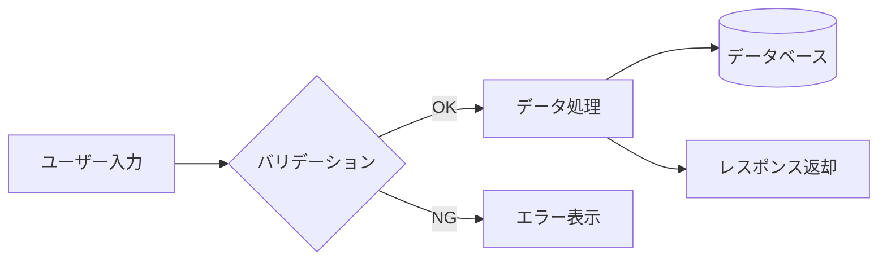

---

# シーケンス図サンプル
> ログインフロー（alt フラグメント付き）

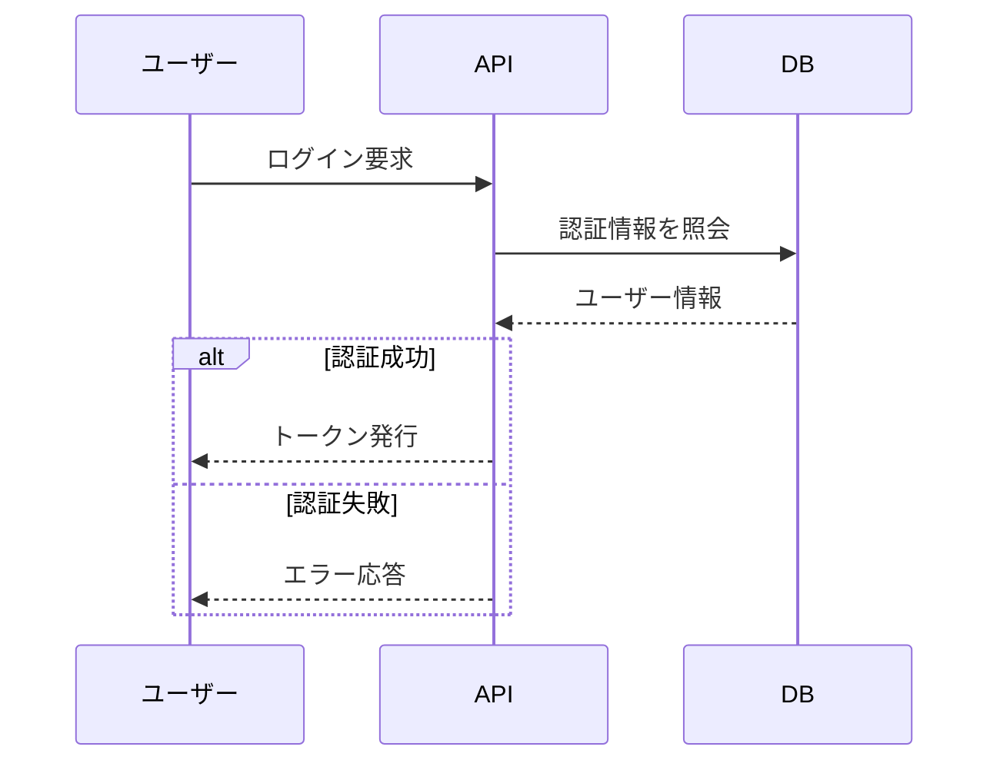

---

# 状態遷移サンプル
> 注文ステートマシン（● = 開始 / ◉ = 終了）

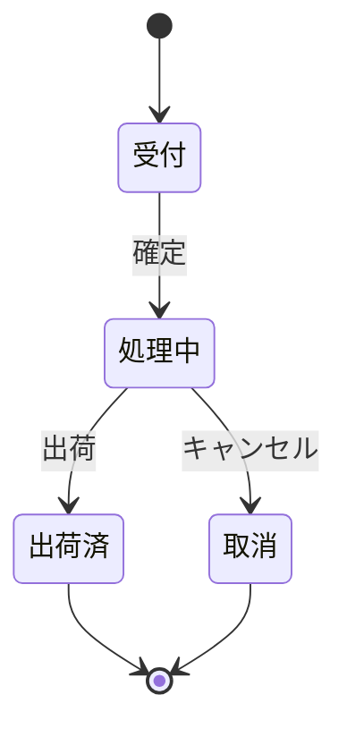

---

# ER図サンプル
> 受注ドメイン（crow's-foot 記法）

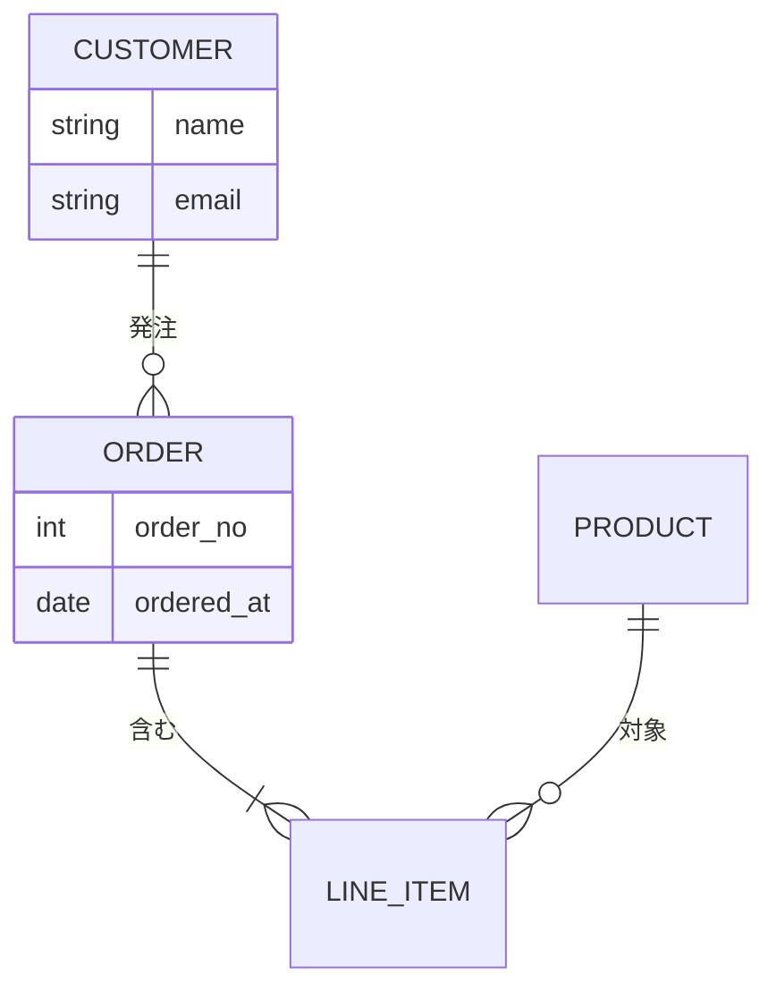

---

# タイムラインサンプル
> プロダクト沿革（section でグルーピング）

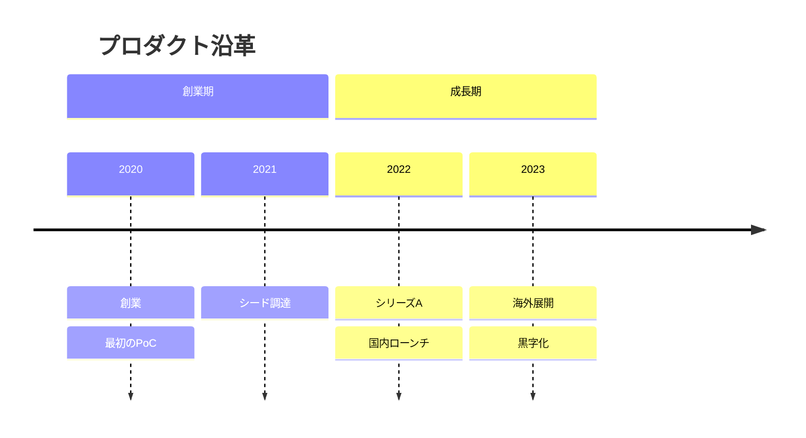

---

# 2x2マトリクスサンプル
> 施策の優先度（実現性 × 影響）

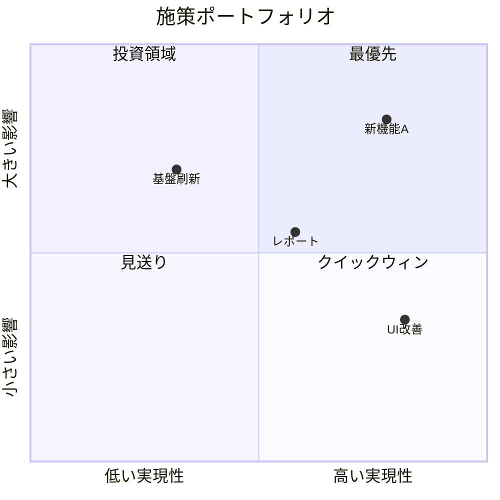

---

# 円グラフサンプル
> 売上構成比（ネイティブ扇形）

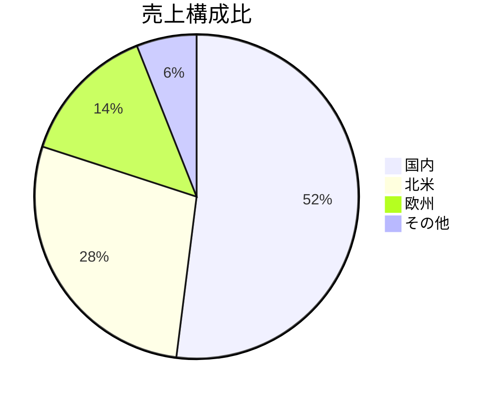

---

# ガントチャートサンプル
> 開発ロードマップ（依存・ステータス・マイルストーン）

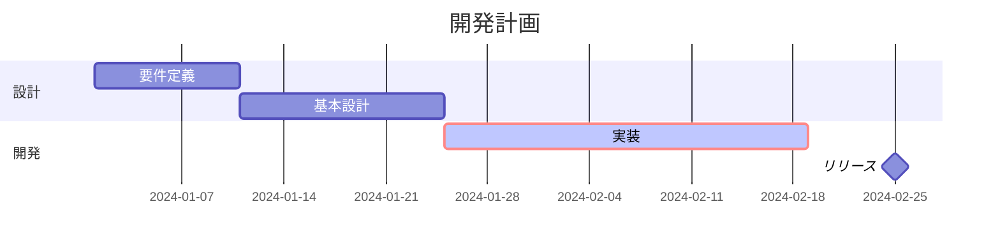

---

# ユーザージャーニーサンプル
> カスタマージャーニー（満足度の推移）

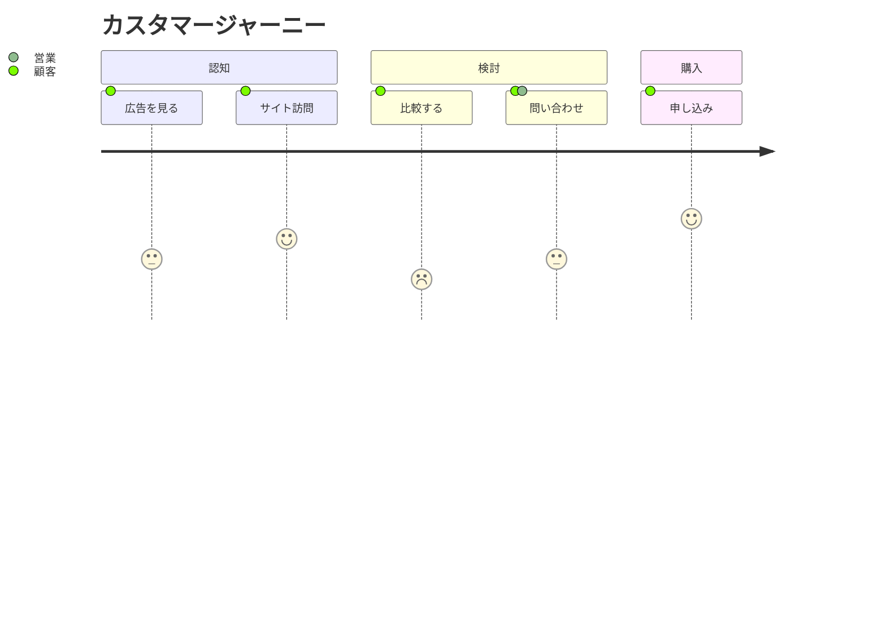

---

# マインドマップサンプル
> アイデア整理（階層ツリー）

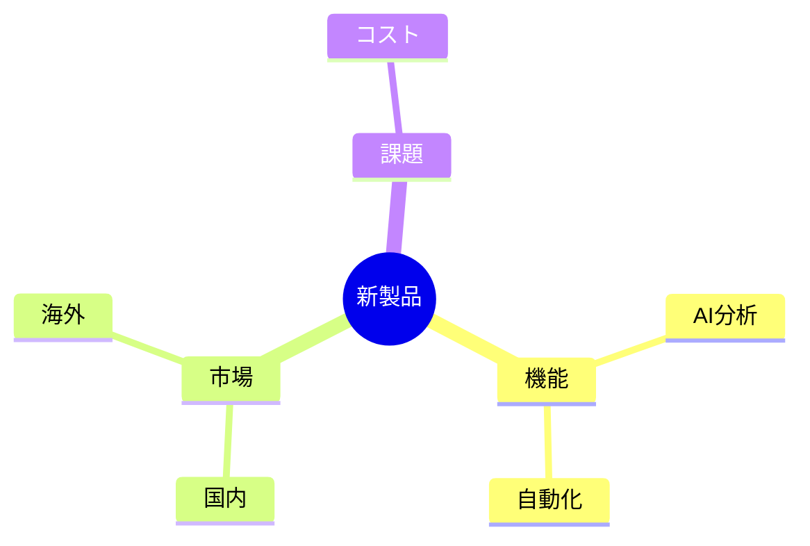

---

# 四半期売上
> 棒グラフ＋折れ線（xychart）

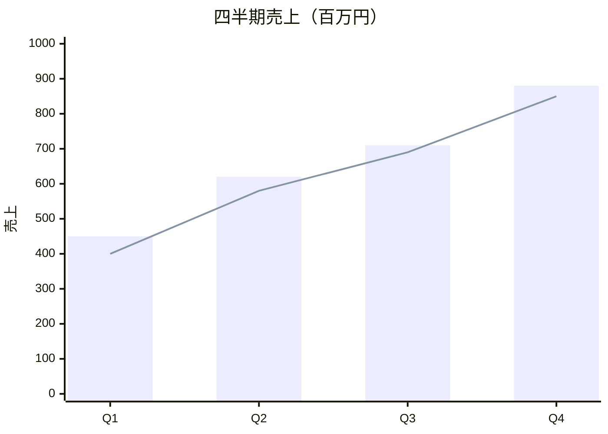

---

# 製品スキル評価
> レーダーチャート（多軸比較）

```diagram
type: radar
title: 製品スキル評価
radar:
  max: 5
  axes: ["技術力", "コスト", "品質", "スピード", "保守性", "拡張性"]
  series:
    - name: 自社製品
      values: [5, 3, 4, 4, 5, 3]
    - name: 競合A
      values: [4, 5, 3, 3, 2, 4]
nodes: []
edges: []
```

---

# 業績サマリ
> KPIカード（大きな数字タイル）

```diagram
type: kpi
title: 2026年度 業績
kpi:
  cards:
    - value: "12.4億"
      label: 年間売上
      delta: "+15%"
      trend: up
    - value: "98%"
      label: 目標達成率
      delta: "+3pt"
      trend: up
    - value: "2.1日"
      label: 平均リードタイム
      delta: "-0.4日"
      trend: down
    - value: "4.6"
      label: 顧客満足度
      delta: "+0.2"
      trend: up
nodes: []
edges: []
```

---

<!-- slide: Column.2Body.Equal -->
# スコープ定義
> In Scope / Out of Scope

<!-- col -->
**対象範囲（In Scope）**

- 顧客データ統合基盤
- AI分析エンジン
- 営業支援モジュール
- モバイルアプリ
- 管理者ダッシュボード

<!-- col -->
**対象外（Out of Scope）**

- 基幹系システム（ERP）刷新
- コールセンターシステム
- 海外拠点対応
- 5年以前のデータ移行

---

# 主要施策
> カード3列（グループ構文 <!-- card --> ＋ ### 見出し）

<!-- card -->
### データ統合
顧客データを単一基盤へ集約

<!-- card -->
### AI分析
予測・レコメンドを自動化

<!-- card -->
### モバイル
現場での即時入力に対応

---

# リスク分析
> Risk Assessment

プロジェクト遂行にあたり、以下のリスクを識別しています。

- **データ移行の品質リスク**: 既存データの整合性チェックに想定以上の工数
- **ユーザー定着リスク**: 新UIへの習熟に時間がかかり一時的な生産性低下
- **ベンダーロックイン**: クラウドサービスへの依存度増大
- **スケジュール遅延**: 要件変更による開発期間の延長

---

<!-- slide: Column.2Body.Equal -->
# システム比較
> System Comparison

<!-- col -->
**現行CRM**

- レスポンス: 3.2秒
- モバイル: 非対応
- AI機能: なし
- 月額コスト: ¥850/user
- カスタマイズ: 低

<!-- col -->
**新CRM（提案）**

- レスポンス: 0.8秒
- モバイル: 完全対応
- AI機能: 予測分析搭載
- 月額コスト: ¥1,200/user
- カスタマイズ: 高

---

# 料金プラン比較
> Pricing Plans（ネイティブ表）

| プラン | 月額/ユーザー | ユーザー数 | サポート |
|------------|--------------|-----------|------------|
| Free | ¥0 | 1 | コミュニティ |
| Pro | ¥1,200 | 〜10 | メール |
| Business | ¥2,400 | 〜50 | 優先メール |
| Enterprise | 要相談 | 無制限 | 専任担当 |

---

# 検知ルールの実装例
> コード / ログ（等幅ブロック）

```yaml
title: 不審なプロセス生成
detection:
  selection:
    EventID: 4688
    NewProcessName|endswith: '\\powershell.exe'
  condition: selection
level: high
```

---

# 導入ロードマップ
> Implementation Roadmap

段階的な移行により、リスクを最小化しながら全社展開を目指します。

- **Phase 1（2026 Q2）**: 要件定義・ベンダー選定
- **Phase 2（2026 Q3-Q4）**: 開発・テスト・データ移行準備
- **Phase 3（2027 Q1）**: パイロット運用（営業部門先行）
- **Phase 4（2027 Q2）**: 全社展開・旧システム廃止

---

<!-- slide: Closing.1Message.Single -->
# ご質問・ご意見をお待ちしています
## Thank You

Category: THANK YOU
Date: プロジェクトマネージャー: 山田 太郎 | taro.yamada@example.com
